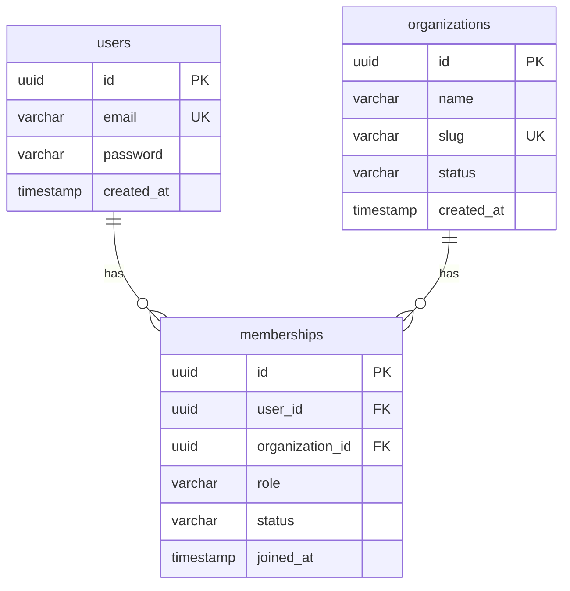

# الدرس ١: Core ERD

في المرحلة الأولى فهمنا الأفكار. من الآن نحوّلها إلى جداول حقيقية. ونبدأ بالأساس الذي يقوم عليه كل شيء: المستأجر، والمستخدم، والعضوية.

## المستوى البسيط: ما هو المخطط؟

**ERD:** اختصار لعبارة Entity Relationship Diagram، ومعناها "مخطط الكيانات والعلاقات". هو خريطة لقاعدة البيانات: كل صندوق جدول، وكل خط علاقة بين جدولين.

أنت تعرف أنواع العلاقات من دورة PostgreSQL: واحد إلى واحد، وواحد إلى كثير، وكثير إلى كثير. والمخطط يرسمها برموز صغيرة عند طرف كل خط:

| الرمز عند طرف الخط | معناه |
|---|---|
| خطان عموديان `││` | واحد بالضبط |
| دائرة وشوكة `o{` | صفر أو أكثر |
| خط وشوكة `│{` | واحد أو أكثر |
| دائرة وخط `o│` | صفر أو واحد |

**كيف تقرأ الخط:** اقرأ من جهة الجدول الأول إلى الثاني. مثلاً: "المستخدم الواحد، بالضبط، يملك صفراً أو أكثر من العضويات".

**والاختصارات داخل الصناديق:**

- **PK:** المفتاح الأساسي، أي معرّف الصف.
- **FK:** مفتاح أجنبي، أي عمود يشير إلى جدول آخر.
- **UK:** قيمة فريدة لا تتكرر في الجدول.

وهذا أول مخطط لنا:

**قراءة المخطط:** المستخدم الواحد له صفر أو أكثر من العضويات، والمؤسسة الواحدة لها صفر أو أكثر من العضويات. ولا يوجد خط مباشر بين المستخدمين والمؤسسات، فالعضوية هي الجسر الوحيد بينهما. هذا هو الجدول الوسيط الذي تحدثنا عنه في الدرس الخامس.

**وهكذا تبدو البيانات الحقيقية في جدول العضويات:**

| المستخدم | المؤسسة | الدور | الحالة |
|---|---|---|---|
| سارة | الأمل | admin | active |
| سارة | النور | member | active |
| أحمد | الأمل | owner | active |
| عمر | النور | owner | active |

سارة لها صفّان، أي عضويتان، ولكل عضوية دور مختلف. هذا بالضبط ما كان مستحيلاً لو وضعنا الدور في جدول المستخدمين.

## المستوى المتوسط: لماذا صُمم كل جدول هكذا؟

**القرار الأول: جدول المستخدمين لا يحتوي عمود مؤسسة.**
هذا مقصود، وهو أهم قرار في المخطط. المستخدم هوية عامة على مستوى المنصة كلها، لا ملك مؤسسة واحدة. وانتماؤه إلى المؤسسات يُحفظ في العضويات فقط. وإضافة عمود مؤسسة إلى المستخدم هي الخطأ الأشهر عند المبتدئين، لأنها تربط كل شخص بمؤسسة واحدة إلى الأبد.

**القرار الثاني: قيمة فريدة للزوج المكوّن من المستخدم والمؤسسة.**
لا يجوز أن يكون لسارة عضويتان في مدرسة الأمل نفسها. لو حدث ذلك، وكانت إحداهما بدور مدير والأخرى بدور عضو، فأي دور يطبّقه النظام؟ والحل قيد فريد على العمودين معاً. وأنت طبّقت النمط نفسه في StoryHub، حين منعت أن يعجب الشخص بالقصة نفسها مرتين.

**القرار الثالث: الاسم المختصر للمؤسسة فريد.**
**Slug:** هو الاسم المختصر الذي يظهر في الرابط، مثل amal في amal.schoolapp.com. ومنه يحدد النظام المستأجر، كما في الدرس الرابع. لذلك يجب ألا يتكرر أبداً.

**تنبيه من تجربتك:** يجب أيضاً منع أسماء محجوزة، مثل www و api و admin و mail. لو سجّلت مؤسسة باسم api، فقد تتعارض مع عنوان واجهتك البرمجية نفسها. وأنت بنيت في StoryHub أداة تمنع أسماء المستخدمين المحجوزة، والفكرة هنا هي نفسها.

**القرار الرابع: عمود حالة في جدولين.**

- **حالة المؤسسة:** نشطة، أو موقوفة، أو في مهلة الحذف. وهي من الدرس الثامن.
- **حالة العضوية:** نشطة، أو دعوة لم تُقبل، أو موقوفة. وهي من الدرس الخامس.

وهما حالتان مستقلتان: قد تكون المؤسسة نشطة، وعضوية شخص فيها موقوفة.

**القرار الخامس: الاسم العام "المؤسسة".**
لم نسمِّ الجدول "المدارس". الاسم العام يسمح للمنصة بخدمة أي نوع من العملاء لاحقاً. وفي السوق ستجد أيضاً أسماء مثل "الحساب" و"مساحة العمل"، والمعنى واحد.

## المستوى العميق

### قاعدة لا تستطيع قاعدة البيانات فرضها وحدها

تذكّر قاعدة "مالك واحد على الأقل" من الدرس الخامس. هل نفرضها بقيد فريد أو بقيد فحص؟ لا. هذه القيود تفحص الصف الواحد، أو تمنع التكرار. أما "يوجد صف واحد على الأقل بدور مالك" فهي قاعدة على مجموعة صفوف كاملة.

لذلك تُفرض في الكود، داخل دالة خدمة واحدة يمر بها كل تغيير للأدوار، وتُغطى باختبارات.

**وفيها فخ:** مالكان في مدرسة الأمل، وكل واحد منهما يخفض دور الآخر إلى مدير في اللحظة نفسها بالضبط. كل دالة تفحص فتجد مالكاً آخر موجوداً، فتسمح. والنتيجة مؤسسة بلا مالك. وهذا من موضوع الدرس التاسع عن الأقفال.

### ماذا يحدث عند الحذف؟

تذكّر الإجراءات المرجعية من المحاضرة الثالثة في دورة PostgreSQL، أي ما يحدث للصفوف المرتبطة عند حذف الصف الأصلي:

- **حذف حساب مستخدم:** تُحذف عضوياته معه، وهذا الحذف المتسلسل منطقي هنا.
- **حذف مؤسسة نهائياً:** تُحذف عضوياتها معها، ولكن فقط بعد مهلة الحذف الناعم من الدرس الثامن.

**ولمحة للدرس القادم:** عندما نضيف جداول البيانات، مثل القصص، فعمود الكاتب لن يُحذف تلقائياً عند حذف المستخدم. هل تتذكر لماذا من الدرس الثاني؟ لأن القصة ملك المؤسسة، لا الكاتب.

### أين الاشتراك؟

لا يظهر في هذا المخطط، لكن مكانه محدد مسبقاً: سيرتبط بجدول المؤسسات، لا بالمستخدمين، لأن المؤسسة هي التي تدفع. وسنصممه في الدرس الثامن من هذه المرحلة.

---

## الخلاصة

قلب أي نظام متعدد المستأجرين ثلاثة جداول: المستخدمون كهوية عامة بلا عمود مؤسسة، والمؤسسات باسم مختصر فريد وحالة، والعضويات كجسر بينهما يحمل الدور والحالة، مع قيد يمنع تكرار الزوج نفسه. وبعض القواعد، مثل "مالك واحد على الأقل"، لا تُفرض بقيود قاعدة البيانات، بل في الكود وبالاختبارات.

## سؤال فهم (الإجابة اختيارية)

تريد مدرسة الأمل أن تظهر سارة باسم "الأستاذة سارة"، بينما تريد مدرسة النور أن تظهر باسم "سارة أحمد". في أي جدول تضع حقل "الاسم الظاهر"، ولماذا؟

## الدرس التالي

**الدرس ٢، Global vs Tenant Tables:** أي الجداول مشتركة للمنصة كلها، وأيها يملكه مستأجر، وكيف تقرر ذلك لأي جدول جديد.

---

## مراجعة إجابة سؤال الفهم

> **إجابتك:** الإجابة هي في جدول memberships

**صحيحة: جدول العضويات.** والسبب هو سبب الدور نفسه: الاسم الظاهر يختلف من مدرسة لأخرى، فمكانه العضوية، لا المستخدم.

## سؤالك عن التعارض

> **سؤالك:** لاحظ انت ضربت مثال لسارة بدورين وفي القاعدة الثاني شرحت انه يجب ان يكون هناك قيد يمنع وجود دورين لنفس الشخص في نفس المؤسسة ؟؟ مش فاهم النقطة هاي وما قصدك

لا يوجد تعارض. الفرق في كلمة واحدة: **نفس** المؤسسة، أو مؤسسة **مختلفة**.

**المثال الأول:** سارة لها عضويتان في مدرستين **مختلفتين**: مديرة في الأمل، وعضوة في النور. هذا مسموح، وهو هدف التصميم كله.

**القيد في القرار الثاني:** يمنع أن يكون لسارة صفّان في المدرسة **نفسها**:

| المستخدم | المؤسسة | الدور | |
|---|---|---|---|
| سارة | الأمل | admin | ✅ مسموح |
| سارة | النور | member | ✅ مسموح، لأن المدرسة مختلفة |
| سارة | الأمل | member | ❌ ممنوع، لأن سارة لها صف في الأمل أصلاً |

القيد لا يقول "المستخدم لا يتكرر"، بل يقول: **"الزوج المكوّن من المستخدم والمؤسسة لا يتكرر"**. فسارة تتكرر، والأمل تتكرر، لكن سارة مع الأمل معاً لا يظهران إلا مرة واحدة.
