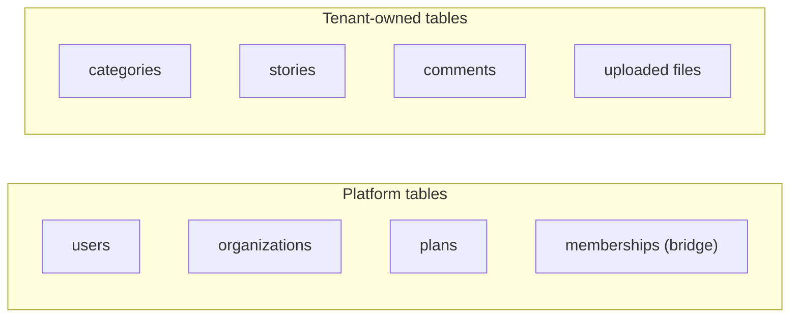
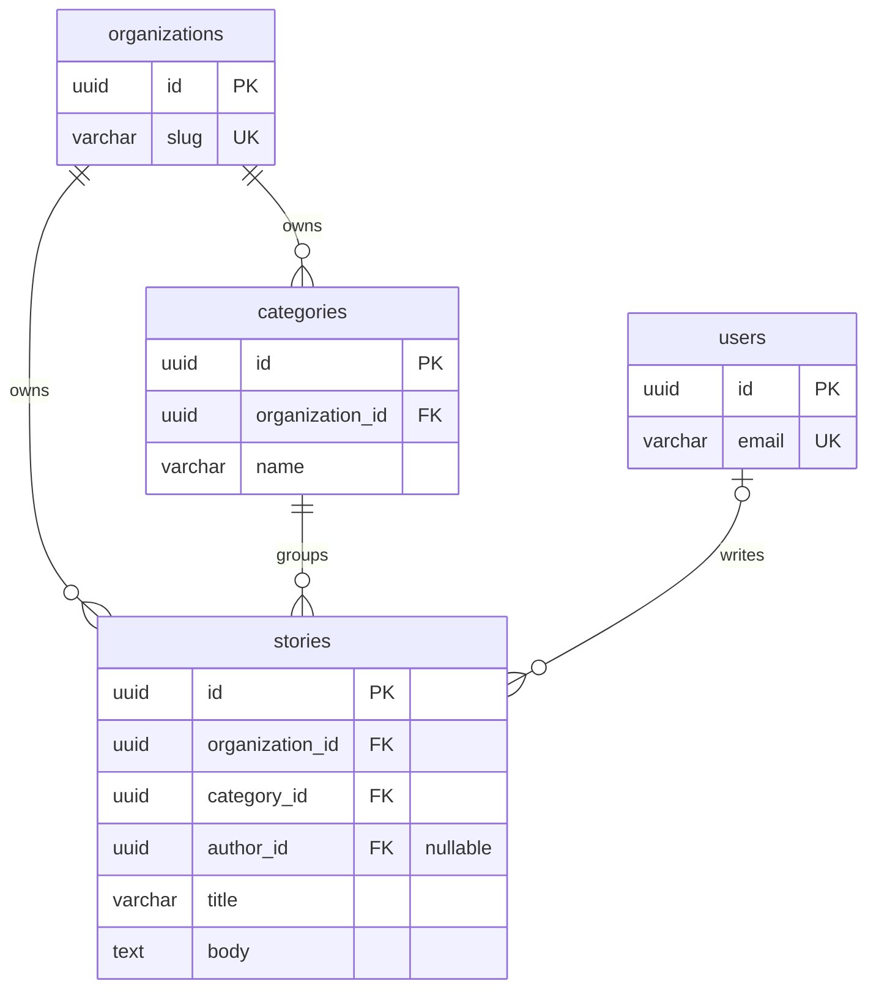

# الدرس ٢: Global vs Tenant Tables

## المستوى البسيط: نوعان من الجداول

ارجع إلى تشبيه العمارة من المرحلة الأولى:

- **ما يخص المبنى كله:** المصعد، وسجل السكان عند موظف الاستقبال. لا يملكه ساكن معيّن.
- **ما داخل كل شقة:** الأثاث والأغراض. يملكه ساكن الشقة وحده، ويخرج معه إذا غادر.

قاعدة البيانات فيها النوعان نفسهما:

- **جداول المنصة، على اليسار:** لا يملكها مستأجر معيّن. المستخدمون هوية عامة كما رأينا في الدرس السابق، والمؤسسات هي المستأجرون أنفسهم، والخطط يحددها مالك المنصة للجميع. أما العضويات فهي الجسر بين الطرفين، مثل سجل السكان عند موظف الاستقبال.
- **جداول المستأجر، على اليمين:** كل صف فيها ملك مؤسسة واحدة، ويحمل عموداً يشير إليها.

### اختبار بسيط لأي جدول جديد

عندما تضيف جدولاً، اسأل نفسك:

> **إذا حُذفت مدرسة الأمل نهائياً، هل يجب أن يُحذف هذا الصف معها؟**

- **نعم:** الجدول ملك المستأجر، ويحتاج عمود المؤسسة.
- **لا:** الجدول من جداول المنصة.

**مثال يحتاج تفكيراً، وهو التصنيفات:** في StoryHub التصنيفات عامة، يضعها المدير وتظهر للجميع. أما في منصة المدارس، فكل مدرسة تريد تصنيفاتها الخاصة: مدرسة تريد "قصص علمية"، وأخرى تريد "أدب الأطفال". إذن هنا تصبح التصنيفات ملك المستأجر.

**الدرس:** المفهوم نفسه قد يكون جدول منصة في منتج، وجدول مستأجر في منتج آخر. والذي يحسم ذلك هو حاجة المنتج، لا اسم الجدول.

## المستوى المتوسط: المخطط بعد إضافة جداول المستأجر

**ثلاث ملاحظات على المخطط:**

**الأولى: عمود المؤسسة موجود في كل جدول مستأجر.** في التصنيفات وفي القصص. وهذا هو "الختم على كل ورقة" من الدرس الثالث في المرحلة الأولى.

**الثانية: الكاتب اختياري.** الخط بين المستخدمين والقصص يبدأ بدائرة وخط، أي "صفر أو واحد". وعمود الكاتب مسموح أن يكون فارغاً. السبب من الدرس الثاني في المرحلة الأولى: إذا حُذف حساب المعلمة سارة، تبقى قصصها ملكاً للمدرسة، ويصبح عمود الكاتب فارغاً فقط. وهذا هو الإجراء المرجعي الذي يجعل العمود فارغاً عند الحذف، وقد درسته في المحاضرة الثالثة من دورة PostgreSQL.

**الثالثة: المستخدمون لم يتغيروا.** ما زالوا بلا عمود مؤسسة، فهم من جداول المنصة.

## المستوى العميق

### هل نضع عمود المؤسسة حتى عندما نستطيع استنتاجه؟

لنأخذ التعليقات. التعليق يتبع قصة، والقصة تتبع مدرسة. إذن نستطيع معرفة مدرسة التعليق عبر قصته. فهل نحتاج عمود المؤسسة في جدول التعليقات أيضاً؟

**الجواب في السوق: نعم، نضعه في كل جدول مستأجر دون استثناء.** مع أن قواعد التصميم التقليدية تقول "لا تكرر المعلومة". والسبب أن تكراره هنا يشتري أماناً وسهولة:

1. **تصفية موحدة:** كل الجداول تُصفّى بالطريقة نفسها، بعمود واحد، دون جمع مع جداول أخرى. وهذا يجعل التصفية التلقائية ممكنة.
2. **حماية قاعدة البيانات أبسط:** في الدرس السادس سنكتب قاعدة أمان لكل جدول. والقاعدة تكون سطراً واحداً عندما يحمل الجدول عموده بنفسه.
3. **الحذف والتصدير أسهل:** "أعطني كل بيانات مدرسة الأمل" يصبح استعلاماً مباشراً على كل جدول، كما رأينا في الدرس الثامن من المرحلة الأولى.

**الثمن:** قد يختلف العمودان. تعليق عمود مؤسسته "النور"، على قصة تتبع "الأمل". كيف نمنع هذا؟ هذا بالضبط موضوع الدرس القادم.

### الملكية شيء، وصلاحية التعديل شيء آخر

خذ سجل التدقيق من الدرس الثامن في المرحلة الأولى. هو ملك المستأجر، فيُحذف مع المدرسة. لكن المدرسة لا تستطيع تعديله أبداً. وكذلك الاشتراك: يتبع المؤسسة، لكن حالته لا يغيّرها إلا نظام الدفع.

إذن عند كل جدول تسأل سؤالين منفصلين:

1. **من يملكه؟** هل يُحذف مع المستأجر؟
2. **من يكتب فيه؟** المستأجر، أم النظام وحده؟

### الجداول المختلطة: فخ تجنّبه في البداية

بعض الأنظمة تجعل جدولاً واحداً يحمل النوعين معاً. مثلاً: تصنيف عمود مؤسسته فارغ يعني "تصنيف افتراضي يظهر لكل المدارس"، وتصنيف عمود مؤسسته مملوء يعني "تصنيف خاص بمدرسة".

هذا يبدو ذكياً، لكنه يعقّد كل شيء: كل استعلام يجب أن يقول "تصنيفاتي أو التصنيفات العامة"، وقواعد الأمان تصبح أصعب، وأي خطأ يفتح باباً للتسرب.

**البديل الأبسط والأكثر أماناً:** عند تجهيز مدرسة جديدة، تُنسخ التصنيفات الافتراضية إليها كصفوف خاصة بها. وهذه هي خطوة التجهيز من الدرس الثامن في المرحلة الأولى.

**لمحة عملية:** في Django يُبنى نموذج أساسي مجرد يحمل عمود المؤسسة، وكل نماذج المستأجر ترث منه. وبهذا لا يمكن أن يُنسى العمود في أي جدول جديد.

---

## الخلاصة

الجداول نوعان: جداول المنصة التي لا يملكها مستأجر، وجداول المستأجر التي يحمل كل صف فيها عمود مؤسسته. والاختبار بسيط: هل يُحذف الصف مع المستأجر؟ ونضع عمود المؤسسة في كل جدول مستأجر حتى لو أمكن استنتاجه، لأن ذلك يجعل التصفية والحماية والحذف أبسط وأكثر أماناً.

## سؤال فهم (الإجابة اختيارية)

جدول الإشعارات يحتوي رسائل مثل: "سارة علّقت على قصتك في مدرسة الأمل". هل هو جدول منصة أم جدول مستأجر؟ وتذكّر أن المستخدم نفسه قد يكون عضواً في مدرستين، ويصله إشعار من كل واحدة منهما.

## الدرس التالي

**الدرس ٣، Scoped Constraints:** كيف نجعل الاسم فريداً داخل المدرسة الواحدة فقط، وكيف نمنع تعليقاً في مدرسة النور من الإشارة إلى قصة في مدرسة الأمل.

---

## مراجعة إجابة سؤال الفهم

> **إجابتك:** جدول مستأجر ؟ مش متأكد من الإجابة

**إجابتك صحيحة: جدول مستأجر.** وهذا سبب يجعلك متأكداً في المرة القادمة. طبّق الاختبار من الدرس:

> إذا حُذفت مدرسة الأمل نهائياً، هل يجب أن يُحذف إشعار "سارة علّقت على قصتك في مدرسة الأمل"؟

نعم، فالإشعار يتحدث عن قصة وتعليق لم يعد لهما وجود. إذن هو جدول مستأجر.

**وما الذي جعلك تتردد؟** كون المستخدم عضواً في مدرستين. لكن هذا لا يغيّر شيئاً: **كل إشعار بمفرده يتبع مدرسة واحدة**. عندما تكون سارة داخل مدرسة الأمل، ترى إشعارات الأمل فقط، وعندما تنتقل إلى النور ترى إشعارات النور. وهكذا يعمل Slack: لكل مساحة عمل إشعاراتها.

والإشعار هنا مثل القصة تماماً: كاتب القصة هوية عامة، والقصة ملك مدرسة. ومستلم الإشعار هوية عامة، والإشعار ملك مدرسة. لذلك يحمل الجدول عمودين: عمود المؤسسة، وعمود المستلم.

**استثناء صغير:** إشعار مثل "تم تغيير كلمة مرورك" لا يتبع أي مدرسة، بل يتبع الحساب نفسه. هذا النوع مكانه جدول منصة منفصل.

---

## ملاحظة لاحقة: تصحيح تصنيف العضويات

في هذا الدرس وُضعت العضويات مع جداول المنصة وسُمّيت "جسراً". لكن في التمرين الختامي، أي الدرس الثاني عشر، صنّفتَها جدول مستأجر، وكان تصنيفك أدق: طبّق الاختبار، فالعضوية تُحذف فعلاً مع المؤسسة.

**الصورة الصحيحة:** العضويات جدول مستأجر، لكنها **استثناء** من التصفية التلقائية بالمؤسسة الحالية. فهي تُقرأ قبل معرفة المؤسسة، في الوسيط وفي قائمة التبديل. لذلك تُصفّى بالمستخدم الحالي: "أعطني عضوياتي أنا".
