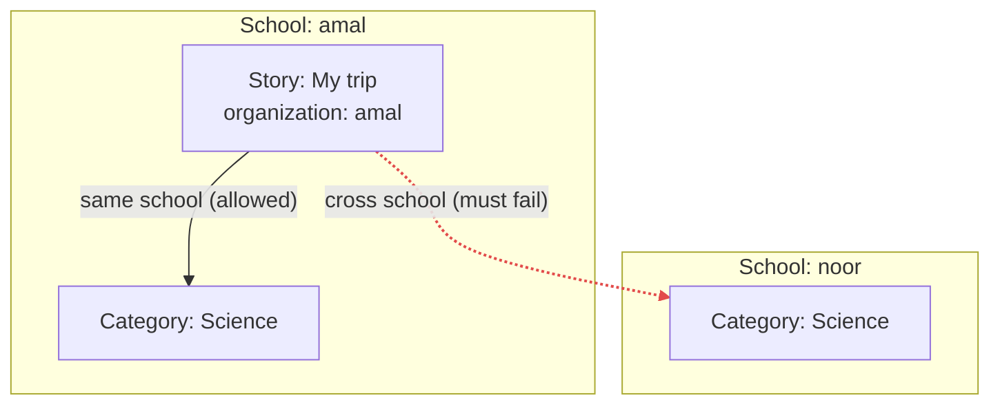

# الدرس ٣: Scoped Constraints

**Scoped:** تعني "محصور في نطاق". والمقصود قيود تعمل داخل حدود المستأجر الواحد.

في هذا الدرس مشكلتان.

## المستوى البسيط

### المشكلة الأولى: الاسم الفريد

مدرسة الأمل أنشأت تصنيفاً اسمه "Science". ثم أرادت مدرسة النور تصنيفاً بالاسم نفسه.

لو وضعنا قيداً فريداً على عمود الاسم وحده، سترفض قاعدة البيانات طلب النور، والسبب أن الأمل سبقتها إلى الاسم. وهذا خطأ واضح، فالمدرستان لا تعرفان بعضهما أصلاً.

**التشبيه:** أرقام البيوت. في كل شارع يوجد بيت رقم ٥. الرقم فريد داخل الشارع الواحد فقط، وليس في المدينة كلها.

**الحل:** القيد الفريد يوضع على العمودين معاً: عمود المؤسسة وعمود الاسم. فيصبح المعنى: "الاسم لا يتكرر داخل المدرسة الواحدة".

وهذا هو النمط نفسه الذي رأيته في الدرس الأول، في الزوج المكوّن من المستخدم والمؤسسة.

### المشكلة الثانية: الإشارة إلى مستأجر آخر

هذه المشكلة أخطر، وذكرناها في الدرس السادس من المرحلة الأولى.

معلم في مدرسة الأمل ينشئ قصة، لكنه يرسل معرّف تصنيف يتبع مدرسة النور. والمفتاح الأجنبي العادي لا يفحص إلا سؤالاً واحداً: "هل هذا التصنيف موجود في الجدول؟" والتصنيف موجود فعلاً، لكن في مدرسة أخرى.



**لاحظ في الرسم شيئين:**

1. **المدرستان عندهما تصنيف باسم "Science".** هذا مسموح، وهو حل المشكلة الأولى.
2. **السهم الأحمر يقفز فوق الجدار** من قصة في الأمل إلى تصنيف في النور. وهذا ما يجب أن يفشل دائماً.

## المستوى المتوسط: ثلاث طبقات تمنع السهم الأحمر

**الطبقة الأولى: في الكود.**
المسلسل في DRF لا يعرض للمعلم إلا تصنيفات مدرسته. فإذا أرسل معرّف تصنيف من مدرسة أخرى، يرد النظام بأنه "غير موجود"، تماماً كما تعلمنا في الدرس السادس من المرحلة الأولى. هذا هو الحل الأساسي.

**الطبقة الثانية: في قاعدة البيانات نفسها.**
هنا الحيلة الذكية في هذا الدرس: **المفتاح الأجنبي المركّب**.

**Composite Foreign Key:** تعني "مفتاح أجنبي مركّب"، أي مفتاح أجنبي يتكون من عمودين معاً بدل عمود واحد.

بدلاً من أن تقول القصة "تصنيفي هو رقم ٢٠"، تقول: "تصنيفي هو رقم ٢٠ **داخل مدرستي نفسها**". فإذا لم يوجد التصنيف ٢٠ داخل مدرسة القصة، ترفض قاعدة البيانات الصف.

جرّبت هذا فعلاً على PostgreSQL المثبت عندك، داخل معاملة ألغيتها في النهاية، فلم يبقَ في قاعدة بياناتك أي أثر:

```sql
CREATE TABLE categories (
    id              int PRIMARY KEY,
    organization_id int NOT NULL REFERENCES organizations(id),
    name            text NOT NULL,
    UNIQUE (organization_id, name),   -- problem 1: unique inside one school
    UNIQUE (organization_id, id)      -- needed so the composite FK can point here
);

CREATE TABLE stories (
    id              int PRIMARY KEY,
    organization_id int NOT NULL REFERENCES organizations(id),
    category_id     int NOT NULL,
    title           text NOT NULL,
    FOREIGN KEY (organization_id, category_id)          -- problem 2:
        REFERENCES categories (organization_id, id)     -- same school only
);
```

```
mohammed=> INSERT INTO organizations VALUES (1, 'amal'), (2, 'noor');
INSERT 0 2
mohammed=> INSERT INTO categories VALUES (10, 1, 'Science'), (20, 2, 'Science');
INSERT 0 2
mohammed=> INSERT INTO categories VALUES (11, 1, 'Science');
ERROR:  duplicate key value violates unique constraint "categories_organization_id_name_key"
DETAIL:  Key (organization_id, name)=(1, Science) already exists.
mohammed=> INSERT INTO stories VALUES (100, 1, 10, 'My trip');
INSERT 0 1
mohammed=> INSERT INTO stories VALUES (101, 1, 20, 'Sneaky story');
ERROR:  insert or update on table "stories" violates foreign key constraint "stories_organization_id_category_id_fkey"
DETAIL:  Key (organization_id, category_id)=(1, 20) is not present in table "categories".
```

**قراءة النتيجة سطراً سطراً:**

- **المدرستان أنشأتا "Science":** نجح الإدخال، لأن الاسم فريد داخل كل مدرسة فقط.
- **الأمل حاولت إنشاء "Science" ثانياً:** رُفض، لأن الاسم مكرر داخل المدرسة نفسها.
- **قصة في الأمل بتصنيف من الأمل:** نجحت. وهذا هو السهم الأخضر.
- **قصة في الأمل بتصنيف ٢٠ من النور:** رُفضت. وهذا هو السهم الأحمر. ورسالة الخطأ واضحة: الزوج "المدرسة ١ مع التصنيف ٢٠" غير موجود.

**سؤال قد يخطر لك:** لماذا وضعنا قيداً فريداً على عمود المؤسسة مع المعرّف، والمعرّف فريد أصلاً؟
السبب أن PostgreSQL يشترط أن يشير المفتاح الأجنبي إلى أعمدة عليها قيد فريد. والمفتاح هنا يشير إلى العمودين معاً، فيجب أن يكون عليهما قيد فريد معاً.

**وهذا يحل مشكلة الدرس السابق أيضاً:** هل تذكر التعليق الذي قد يحمل عمود مؤسسة يختلف عن مؤسسة قصته؟ المفتاح المركّب نفسه يمنع ذلك تماماً.

**ملاحظة صادقة عن Django:** حسب علمي، لا يوفر Django هذا النوع من المفاتيح بطريقة مباشرة وبسيطة. لكن يمكن إضافته بترحيل يكتب SQL بنفسه. وسنفحص ما تدعمه نسخة Django عندك فعلاً عندما نصل إلى التنفيذ.

**الطبقة الثالثة: الاختبارات.**
اختبار يحاول عمداً إنشاء قصة بتصنيف من مدرسة أخرى، ويتأكد أن الطلب يُرفض.

## المستوى العميق

### اسأل عن نطاق كل قيمة فريدة

عند كل حقل فريد، اسأل: **"فريد داخل ماذا؟"**

| الحقل | نطاق الفرادة | السبب |
|---|---|---|
| بريد المستخدم | المنصة كلها | هوية عامة يُسجَّل الدخول بها |
| الاسم المختصر للمؤسسة | المنصة كلها | يُستعمل في النطاق الفرعي |
| اسم التصنيف | داخل المؤسسة | المدارس لا تعرف بعضها |
| المستخدم مع المؤسسة | داخل المؤسسة | عضوية واحدة لكل شخص في كل مدرسة |

**الخطأ الشائع:** أن تضع حقلاً في النطاق الخاطئ. مثلاً، لو جعلت اسم التصنيف فريداً على مستوى المنصة، فستكشف للمدرسة أن مدرسة أخرى تستعمل الاسم نفسه. وهذا تسريب صغير للمعلومات.

### حالة الأحرف

"Science" و "science" كلمتان مختلفتان في نظر قاعدة البيانات، فيمر التكرار بينهما. والحل قيد فريد على النسخة الصغيرة من الاسم. وأنت تعرف هذه الفكرة من توحيد البريد إلى أحرف صغيرة في DjangoStarter.

### الحذف الناعم مع القيد الفريد

هذا الفخ يقع فيه كثيرون. مدرسة الأمل حذفت تصنيف "Science" حذفاً ناعماً، فاختفى من الواجهة، لكن صفه ما زال موجوداً. ثم حاولت إنشاء "Science" جديداً، فرفضت قاعدة البيانات، لأن الصف القديم ما زال يحجز الاسم.

**الحل:** قيد فريد مشروط، يعمل على الصفوف غير المحذوفة فقط. وأنت تملك نموذج حذف ناعم في DjangoStarter، فهذا الفخ سيواجهك فعلياً. وقيود Django الفريدة تدعم شرطاً بهذا الشكل.

---

## الخلاصة

القيم الفريدة في جداول المستأجر تكون فريدة داخل المؤسسة فقط، بوضع القيد على عمود المؤسسة مع الحقل. والإشارة إلى صف في مستأجر آخر تُمنع على ثلاث طبقات: الكود، ثم المفتاح الأجنبي المركّب في قاعدة البيانات، ثم الاختبارات. ومع كل حقل فريد اسأل "فريد داخل ماذا؟"، وانتبه لحالة الأحرف وللحذف الناعم.

## سؤال فهم (الإجابة اختيارية)

رابط القصة يكون بهذا الشكل: amal.schoolapp.com/stories/my-trip. هل يجب أن يكون الجزء الأخير، أي my-trip، فريداً على مستوى المنصة كلها، أم داخل المدرسة فقط؟ ولماذا؟

## الدرس التالي

**الدرس ٤، Multi-Tenant Indexing:** كيف نرتب الفهارس بحيث يبدأ كل بحث بعمود المؤسسة، وكيف نقرأ خطة التنفيذ لنتأكد. وهذا يُكمل موضوع الفهرسة المؤجل من دورة PostgreSQL.

---

## مراجعة إجابة سؤال الفهم

> **إجابتك:** داخل المدرسة فقط , لانه يمكن لمدرسة اخرى نشر قصة بعنوان مشابه او بنفس العنوان

**إجابة صحيحة.** ويضاف إليها سبب ثانٍ: النطاق الفرعي في أول الرابط يحدد المدرسة أصلاً. فالرابطان amal.schoolapp.com/stories/my-trip و noor.schoolapp.com/stories/my-trip مختلفان تماماً، حتى لو تطابق الجزء الأخير. إذن يكفي أن يكون فريداً داخل المدرسة، ونضع القيد على عمود المؤسسة مع الاسم المختصر للقصة، كما تعلمنا في الدرس.
