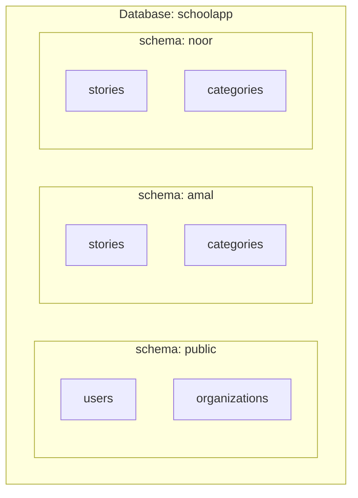

# الدرس ٥: Schema-per-Tenant

في الدرس الثالث من المرحلة الأولى عرفنا ثلاث طرق للعزل. اليوم نجرب الطريقة الثانية بأيدينا: **درج لكل مستأجر**، أي مخطط مستقل لكل مدرسة داخل قاعدة بيانات واحدة.

## المستوى البسيط: شكل قاعدة البيانات



**لاحظ ثلاثة أشياء:**

1. **مخطط public** يحمل جداول المنصة من الدرس الثاني: المستخدمين والمؤسسات. هذه مشتركة للجميع.
2. **لكل مدرسة مخطط** يحمل جداول المستأجر، بالأسماء نفسها تماماً: stories و categories في الأمل، و stories و categories في النور.
3. **لا يوجد عمود مؤسسة في جداول المدارس.** فالمخطط نفسه هو "الختم". القصة الموجودة في مخطط الأمل هي قصة من الأمل حتماً.

### كيف يعرف PostgreSQL أي درج يفتح؟

**search_path:** تعني "مسار البحث". هي قائمة مخططات يبحث فيها PostgreSQL بالترتيب، عندما تكتب اسم جدول دون أن تذكر مخططه.

تذكر هذا من المحاضرة الأولى في دورتك: عندما تكتب SELECT من stories فقط، يبحث PostgreSQL في المخطط الأول من القائمة، فإن لم يجد الجدول انتقل للتالي.

**والفكرة كلها هنا:** في بداية كل طلب، يغيّر النظام مسار البحث إلى مخطط المدرسة. فيكتب الكود الاستعلام نفسه دائماً، وPostgreSQL يفتح الدرج الصحيح من نفسه. وهذا بالضبط ما تفعله مكتبة django-tenants: الوسيط يحدد المستأجر، كما في الدرس الرابع من المرحلة الأولى، ثم يضبط مسار البحث على مخططه.

## المستوى المتوسط: التجربة على جهازك

أنشأت قاعدة بيانات مؤقتة اسمها saas_lab، وجربت فيها، ثم حذفتها بالكامل. هذه النتائج الحقيقية.

**الخطوة الأولى: البناء.**

```
saas_lab=> CREATE TABLE public.users (id int PRIMARY KEY, email text UNIQUE);
CREATE TABLE
saas_lab=> CREATE SCHEMA amal;
CREATE SCHEMA
saas_lab=> CREATE SCHEMA noor;
CREATE SCHEMA
saas_lab=> CREATE TABLE amal.stories (id int PRIMARY KEY, title text);
CREATE TABLE
saas_lab=> CREATE TABLE noor.stories (id int PRIMARY KEY, title text);
CREATE TABLE
saas_lab=> INSERT INTO public.users VALUES (1, 'sara@example.com');
INSERT 0 1
saas_lab=> INSERT INTO amal.stories VALUES (1, 'Amal: Science fair');
INSERT 0 1
saas_lab=> INSERT INTO noor.stories VALUES (1, 'Noor: Sports day');
INSERT 0 1
saas_lab=> \dn
      List of schemas
  Name  |       Owner
--------+-------------------
 amal   | mohammed
 noor   | mohammed
 public | pg_database_owner
(3 rows)
```

لاحظ أن القصتين تحملان المعرّف نفسه، أي ١. وهذا ممكن لأنهما في جدولين منفصلين فعلياً.

**الخطوة الثانية: الاستعلام نفسه، ودرجان مختلفان.**

```
saas_lab=> SHOW search_path;
   search_path
-----------------
 "$user", public
(1 row)

saas_lab=> SET search_path TO amal, public;
SET
saas_lab=> SELECT * FROM stories;
 id |       title
----+--------------------
  1 | Amal: Science fair
(1 row)

saas_lab=> SELECT * FROM users;
 id |      email
----+------------------
  1 | sara@example.com
(1 row)

saas_lab=> SET search_path TO noor, public;
SET
saas_lab=> SELECT * FROM stories;
 id |      title
----+------------------
  1 | Noor: Sports day
(1 row)
```

**ما الذي حدث؟**

- **عندما كان المسار "الأمل ثم العام":** جملة SELECT من stories وجدت قصص الأمل. وجملة SELECT من users لم تجد جدول المستخدمين في الأمل، فانتقلت إلى المخطط العام ووجدته هناك.
- **عندما تغيّر المسار إلى "النور ثم العام":** الجملة نفسها حرفياً أعادت قصص النور.

**الخطوة الثالثة: هل الدرج مقفل فعلاً؟**

```
saas_lab=> SET search_path TO amal, public;
SET
saas_lab=> SELECT * FROM noor.stories;
 id |      title
----+------------------
  1 | Noor: Sports day
(1 row)
```

**هذه أهم نتيجة في التجربة.** المسار مضبوط على الأمل، ومع ذلك قرأنا قصص النور بمجرد كتابة اسم المخطط صراحة. مسار البحث مجرد **اختيار افتراضي**، وليس قفلاً.

والسبب أن النظام كله يتصل بقاعدة البيانات بحساب واحد له صلاحية على كل المخططات. وهذا بالضبط ما ناقشناه في سؤال المستشفيات: الأدراج في خزانة واحدة، ومفتاح واحد يفتحها كلها.

## المستوى العميق: ثمن هذه الطريقة

### الترحيلات تتكرر، وقد تنحرف المخططات

**الخطوة الرابعة من التجربة.** تخيّل أن مبرمجاً أضاف في الماضي عموداً اسمه summary إلى مخطط النور وحده، كإصلاح سريع لطلب من تلك المدرسة، ونوعه رقم:

```
saas_lab=> ALTER TABLE noor.stories ADD COLUMN summary int;
ALTER TABLE
```

اليوم جاء ترحيل جديد يضيف عموداً باسم summary نصياً لكل المدارس. والترحيل يعمل على كل مخطط بمفرده:

```
saas_lab=> ALTER TABLE amal.stories ADD COLUMN summary text;
ALTER TABLE
saas_lab=> ALTER TABLE noor.stories ADD COLUMN summary text;
ERROR:  column "summary" of relation "stories" already exists
```

والنتيجة:

```
saas_lab=> \d amal.stories
                Table "amal.stories"
 Column  |  Type   | Collation | Nullable | Default
---------+---------+-----------+----------+---------
 id      | integer |           | not null |
 title   | text    |           |          |
 summary | text    |           |          |
Indexes:
    "stories_pkey" PRIMARY KEY, btree (id)

saas_lab=> \d noor.stories
                Table "noor.stories"
 Column  |  Type   | Collation | Nullable | Default
---------+---------+-----------+----------+---------
 id      | integer |           | not null |
 title   | text    |           |          |
 summary | integer |           |          |
Indexes:
    "stories_pkey" PRIMARY KEY, btree (id)
```

**صار عندنا مدرستان بجدولين مختلفين في الشكل.** الكود يتوقع عموداً نصياً، فيعمل في الأمل، وينكسر في النور. ومع ٥٠٠ مدرسة بدل اثنتين، قد تكتشف هذا بعد أسابيع.

**Schema Drift:** هو اسم هذه المشكلة، ويعني "انحراف المخططات". أي أن المخططات التي يُفترض أن تكون متطابقة صارت مختلفة.

**القاعدة الذهبية لهذه الطريقة:** لا يُعدَّل مخطط مدرسة واحدة يدوياً أبداً. كل تغيير يمر عبر الترحيلات، ويُطبَّق على الجميع.

### بقية الثمن، بإيجاز

- **وقت الترحيل:** ترحيل يأخذ ثانية واحدة، يأخذ عشر دقائق مع ٦٠٠ مدرسة.
- **تجهيز مدرسة جديدة:** يعني إنشاء مخطط وتشغيل كل الترحيلات عليه من البداية، كما ذكرنا في الدرس الثامن من المرحلة الأولى.
- **العدد الكبير:** آلاف المخططات تعني عشرات الآلاف من الجداول، وهذا يثقل على PostgreSQL نفسه وعلى أدوات النسخ الاحتياطي.

### ومتى تستحق الثمن؟

- **عدد مدارس متوسط:** عشرات أو مئات، لا عشرات الآلاف.
- **حاجة لاستعادة مدرسة واحدة:** تستطيع نسخ مخطط واحد واستعادته وحده.
- **حاجة لفصل أوضح من العمود:** مع إدراك أنه ليس فصلاً تاماً، كما رأيت في الخطوة الثالثة.

**ومع ذلك يبقى اختيارنا للمشروع التمهيدي هو الجداول المشتركة،** لأنها الأشيع في السوق، ولأنها تُعلّمك الجدران التي تبنيها بنفسك. أما هذه الطريقة فصرت الآن تفهم كيف تعمل من الداخل، وهذا ما ستحتاجه حين تقابلها في وظيفة أو مشروع.

**هل تريد أن تجرب بيدك؟** الأوامر أعلاه كلها تعمل كما هي. أنشئ قاعدة بيانات تجريبية بالأمر createdb saas_lab، ثم نفّذها في psql بالترتيب.

---

## الخلاصة

في طريقة الدرج لكل مستأجر، تعيش جداول المنصة في المخطط العام، ولكل مدرسة مخطط بجداولها بالأسماء نفسها. ومسار البحث يحدد الدرج المفتوح، فيكتب الكود الاستعلام نفسه لكل المدارس. لكن مسار البحث اختيار افتراضي لا قفل، والترحيلات تتكرر لكل مخطط، ويهددها انحراف المخططات إذا عُدّل أي مخطط يدوياً.

## سؤال فهم (الإجابة اختيارية)

في هذه الطريقة، أين تضع جدول الخطط والأسعار، أي الأساسية والمتقدمة والذهبية؟ في المخطط العام، أم في مخطط كل مدرسة؟ ولماذا؟

## الدرس التالي

**الدرس ٦، Row-Level Security:** نعود إلى الجداول المشتركة، ونجعل PostgreSQL نفسه يرفض إظهار صفوف مدرسة أخرى، حتى لو نسي الكود التصفية. وفيه الجواب على المشكلة التي رأيتها في الخطوة الثالثة.

---

## مراجعة إجابة سؤال الفهم

> **إجابتك:** في المخطط العام، لأنها مشتركة لكل المدارس.

**إجابة صحيحة.** الخطط واحدة لكل المدارس، ويحددها مالك المنصة، فمكانها المخطط العام. وكذلك **اشتراك** كل مدرسة، أي على أي خطة هي الآن: مكانه المخطط العام أيضاً، مرتبطاً بجدول المؤسسات. فالمنصة هي التي تدير الفوترة، والمدرسة لا تملك تعديل حالة اشتراكها بنفسها، كما قلنا في الدرس الثاني.
