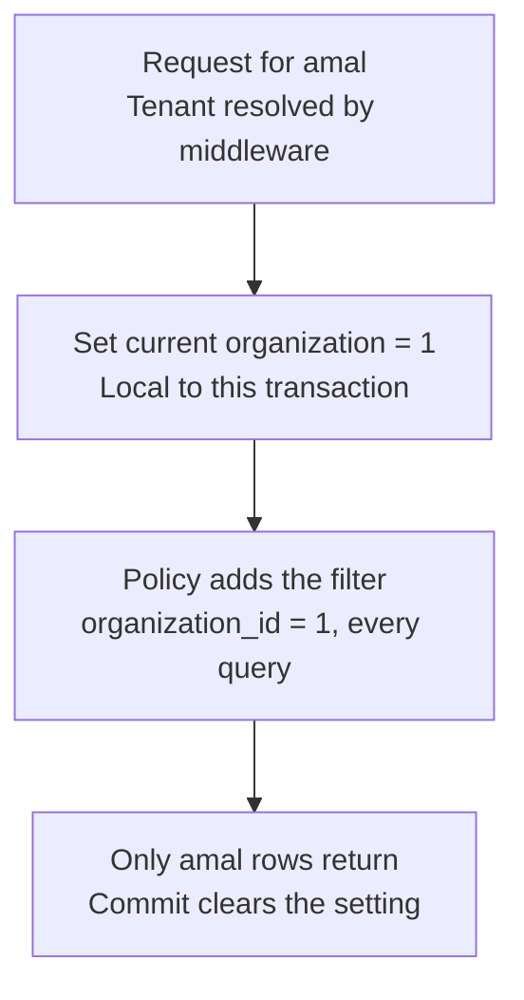

# الدرس ٦: Row-Level Security

**Row-Level Security:** تعني "الأمان على مستوى الصف". هي قواعد تُكتب داخل قاعدة البيانات نفسها، وتحدد أي الصفوف يحق لكل طلب أن يراها.

## المستوى البسيط

### الفكرة

في الدرس السابق رأيت أن مسار البحث مجرد اختيار افتراضي، لا قفل. اليوم نبني قفلاً حقيقياً، لكن على الجداول المشتركة هذه المرة.

**التشبيه:** أمين مكتبة لا يسلّمك إلا الكتب التي تحمل ختم مدرستك. اطلب ما شئت: "أعطني كل الكتب"، أو "أعطني الكتاب رقم ٣". الأمين يطبّق القاعدة على كل طلب، فلا يخرج من يده إلا كتب مدرستك.

### الجزءان

1. **القاعدة:** تُكتب مرة واحدة لكل جدول. مثلاً: "لا تُظهر من جدول القصص إلا الصفوف التي عمود مؤسستها يساوي المؤسسة الحالية".
2. **المؤسسة الحالية:** في بداية كل طلب، يخبر التطبيق قاعدة البيانات: "هذا الطلب لمدرسة رقم ١". ثم تطبّق قاعدة البيانات القاعدة على كل استعلام تلقائياً.

**Policy:** هو اسم القاعدة في PostgreSQL، ويعني "سياسة".

وهذه الطبقة الثالثة من طبقات الحماية الخمس التي تعلمناها في الدرس السادس من المرحلة الأولى.

## المستوى المتوسط: التجربة على جهازك

أنشأت مرة أخرى قاعدة بيانات مؤقتة باسم saas_lab، ثم حذفتها في النهاية. وهذه النتائج الحقيقية.

**الخطوة الأولى: جدول مشترك، وقاعدة.**

```
saas_lab=> CREATE TABLE stories (id int PRIMARY KEY, organization_id int NOT NULL, title text);
CREATE TABLE
saas_lab=> INSERT INTO stories VALUES (1, 1, 'Amal: Science fair'), (2, 1, 'Amal: Poetry'), (3, 2, 'Noor: Sports day');
INSERT 0 3
saas_lab=> ALTER TABLE stories ENABLE ROW LEVEL SECURITY;
ALTER TABLE
saas_lab=> CREATE POLICY tenant_isolation ON stories
               USING (organization_id = current_setting('app.current_org')::int);
CREATE POLICY
saas_lab=> SELECT * FROM stories;
 id | organization_id |       title
----+-----------------+--------------------
  1 |               1 | Amal: Science fair
  2 |               1 | Amal: Poetry
  3 |               2 | Noor: Sports day
(3 rows)
```

**ما معنى سطر القاعدة؟**

- **app.current_org:** متغيّر نخترع اسمه بأنفسنا، ونضع فيه رقم المؤسسة الحالية.
- **current_setting:** دالة تقرأ قيمة هذا المتغيّر.
- **USING:** الشرط الذي يجب أن يحققه الصف حتى يظهر.

**لكن انتبه للنتيجة:** فعّلنا الأمان وكتبنا القاعدة، ومع ذلك ظهرت الصفوف الثلاثة كلها. لماذا؟

**هذا أشهر فخ في هذه الخاصية: مالك الجدول مستثنى من القواعد افتراضياً.** وأنا أنشأت الجدول بحسابك، فحسابك هو المالك.

**الحل له طريقتان:**

1. **في الإنتاج، وهي الأفضل:** التطبيق يتصل بقاعدة البيانات بحساب ليس مالكاً للجداول. والحساب المالك يُستعمل للترحيلات فقط.
2. **إجبار المالك نفسه على القواعد:** بأمر اسمه FORCE ROW LEVEL SECURITY.

**ملاحظة صادقة عن التجربة:** أردت أن أجرب الطريقة الأولى، لكن حسابك على PostgreSQL لا يملك صلاحية إنشاء حسابات جديدة. لذلك استعملت الطريقة الثانية، والنتيجة من حيث الفكرة واحدة.

**الخطوة الثانية: إجبار القاعدة، ثم الطلب دون تحديد مدرسة.**

```
saas_lab=> ALTER TABLE stories FORCE ROW LEVEL SECURITY;
ALTER TABLE
saas_lab=> SELECT * FROM stories;
ERROR:  unrecognized configuration parameter "app.current_org"
```

لم نحدد المدرسة بعد، فرفضت قاعدة البيانات الطلب كله. وهذا هو السلوك الصحيح تماماً: **عند الشك، لا تُظهر شيئاً.**

**Fail Closed:** هو اسم هذا المبدأ، ويعني "عند الفشل، أغلق الباب". وعكسه أن يُظهر النظام كل شيء عند الفشل، وهذا ما نخشاه.

**الخطوة الثالثة: طلب لمدرسة الأمل.**

```
saas_lab=> SET app.current_org = '1';
SET
saas_lab=> SELECT * FROM stories;
 id | organization_id |       title
----+-----------------+--------------------
  1 |               1 | Amal: Science fair
  2 |               1 | Amal: Poetry
(2 rows)

saas_lab=> SELECT * FROM stories WHERE id = 3;
 id | organization_id | title
----+-----------------+-------
(0 rows)
```

**السطر الثاني هو الأهم.** طلبنا القصة رقم ٣ صراحة بمعرّفها، وهي من مدرسة النور. فلم تظهر، وكأنها غير موجودة. هذه هي ثغرة الوصول المباشر بالمعرّف، وقد أغلقتها قاعدة البيانات بنفسها، حتى دون أي تصفية في الاستعلام.

وهذا جواب المشكلة التي رأيتها في الخطوة الثالثة من الدرس السابق: هنا لا توجد طريقة للوصول إلى صفوف مدرسة أخرى بمجرد ذكرها.

**الخطوة الرابعة: محاولة كتابة صف لمدرسة أخرى.**

```
saas_lab=> INSERT INTO stories VALUES (4, 2, 'Sneaky story');
ERROR:  new row violates row-level security policy for table "stories"
```

نحن في طلب لمدرسة الأمل، وحاولنا إنشاء قصة باسم مدرسة النور، فرُفض الإدخال. القاعدة نفسها تحمي القراءة والكتابة معاً.

**الخطوة الخامسة: طلب لمدرسة النور.**

```
saas_lab=> SET app.current_org = '2';
SET
saas_lab=> SELECT * FROM stories;
 id | organization_id |      title
----+-----------------+------------------
  3 |               2 | Noor: Sports day
(1 row)
```

الاستعلام نفسه حرفياً، والنتيجة قصص النور فقط.

وهذه الرحلة كاملة في رسم:



## المستوى العميق

### الخطر الخفي: الاتصال الذي يتذكر

في StoryHub ضبطت إعداداً يجعل Django يحتفظ باتصال قاعدة البيانات مفتوحاً، ويعيد استعماله بين الطلبات. وهذا يوفر الوقت. لكن انظر ماذا يعني هنا:

1. **الطلب الأول من مدرسة الأمل** يضبط المؤسسة الحالية على ١، على مستوى الاتصال كله.
2. **ينتهي الطلب،** ويبقى الاتصال مفتوحاً، **وما زال يتذكر الرقم ١**.
3. **الطلب الثاني من مدرسة النور** يأخذ الاتصال نفسه، لكن بسبب خطأ ما لم يضبط المؤسسة.
4. **النتيجة:** مستخدم من النور يرى بيانات الأمل.

أي أن طبقة الحماية نفسها صارت سبب التسرب.

**الحل: إعداد خاص بالمعاملة وحدها.** المعاملة هي ما تعلمته في دورتك: مجموعة أوامر تنجح كلها أو تُلغى كلها. والدالة set_config تقبل خياراً ثالثاً يجعل القيمة تعيش داخل المعاملة فقط، وتختفي تلقائياً عند نهايتها:

```
saas_lab=> RESET app.current_org;
RESET
saas_lab=> SELECT * FROM stories;
ERROR:  invalid input syntax for type integer: ""

saas_lab=> BEGIN;
BEGIN
saas_lab=> SELECT set_config('app.current_org', '1', true);
 set_config
------------
 1
(1 row)

saas_lab=> SELECT * FROM stories;
 id | organization_id |       title
----+-----------------+--------------------
  1 |               1 | Amal: Science fair
  2 |               1 | Amal: Poetry
(2 rows)

saas_lab=> COMMIT;
COMMIT
saas_lab=> SHOW app.current_org;
 app.current_org
-----------------

(1 row)

saas_lab=> SELECT * FROM stories;
ERROR:  invalid input syntax for type integer: ""
```

**قراءة النتيجة:**

- **الخيار الثالث true** يعني: هذه القيمة للمعاملة الحالية فقط.
- **داخل المعاملة** ظهرت قصص الأمل.
- **بعد COMMIT** صارت القيمة فارغة، وأي استعلام بعدها فشل. أي أن الاتصال لم يتذكر شيئاً، وحتى لو أعاده Django لطلب آخر، فلن يرى ذلك الطلب أي بيانات حتى يحدد مدرسته بنفسه.

**لاحظ نوع الخطأ:** "قيمة فارغة لا تصلح رقماً". الرسالة ليست جميلة، لكنها فشل مغلق، وهذا هو المهم. وبعض الفرق تكتب القاعدة بطريقة تُعيد صفر صفوف بدل الخطأ. أما أنا فأفضّل الخطأ الصريح، لأنه يظهر في الاختبارات فوراً، بينما الصفوف الفارغة قد تمر دون أن ينتبه أحد.

**الخلاصة العملية للمرحلة الثالثة:** كل طلب يعمل داخل معاملة، وأول ما يفعله داخلها أن يضبط المؤسسة الحالية بإعداد خاص بالمعاملة.

### أمور أخرى يجب أن تعرفها

- **كل جدول مستأجر يحتاج قاعدته:** وهنا تظهر فائدة أن يحمل كل جدول عمود مؤسسته بنفسه، كما قررنا في الدرس الثاني. فالقاعدة سطر واحد مكرر في كل جدول.
- **القاعدة تحتاج فهرساً:** القاعدة تضيف شرط المؤسسة إلى كل استعلام. وكما تعلمنا في الدرس الرابع، هذا الشرط يحتاج فهرساً يبدأ بعمود المؤسسة، وإلا صار كل استعلام بطيئاً.
- **تقارير مالك المنصة:** تحتاج أحياناً بيانات كل المدارس. والطريقة الصريحة لذلك حساب منفصل في قاعدة البيانات، مُعطى صلاحية تجاوز القواعد، ولا يُستعمل إلا في سكربتات الإدارة. هذا هو مبدأ "الآمن هو الافتراضي" من المرحلة الأولى: الطريق الخطير موجود، لكنه منفصل ومتعمد.
- **هذه شبكة أمان، لا بديل عن الكود:** التصفية في الكود، وهي الطبقة الثانية، تبقى الأساس. فهي التي تعطي ردوداً واضحة مثل "غير موجود"، وتعمل بشكل طبيعي مع ORM. أما هذه الطبقة فتمسك ما أفلت من الكود.

---

## الخلاصة

الأمان على مستوى الصف يجعل PostgreSQL نفسه يطبّق شرط المؤسسة على كل استعلام في الجدول، قراءة وكتابة، فيُغلق ثغرة الوصول بالمعرّف حتى لو نسيها الكود. له فخان: مالك الجدول مستثنى افتراضياً، فاتصل بحساب غير مالك أو أجبر القاعدة؛ والاتصال الذي يُعاد استعماله قد يتذكر مدرسة الطلب السابق، فاضبط المؤسسة داخل المعاملة فقط. وعند غياب الإعداد يجب أن يفشل الطلب، لا أن يُظهر كل شيء.

## سؤال فهم (الإجابة اختيارية)

في الخطوة الثانية، طلبنا القصص دون أن نحدد المدرسة، فظهر خطأ. لو كتبنا القاعدة بطريقة مختلفة، فصار غياب المدرسة يعني "أظهر كل الصفوف"، فما الخطر؟ وأي طبقة من طبقات الحماية كانت ستُكتشف بها هذه المشكلة قبل الإنتاج؟

## الدرس التالي

**الدرس ٧، RBAC Design:** تصميم الأدوار والصلاحيات داخل كل مؤسسة: هل تكفي الأدوار الثابتة الأربعة، أم تحتاج المؤسسات أدواراً تصنعها بنفسها؟

---

## مراجعة إجابة سؤال الفهم

> **إجابتك:** الخطر كما ذكرنا دائما تسريب البيانات , والطبقة التي تكشف الخطاء هي الطبقة الأخيرة طبقة الاختبارات

**إجابتك صحيحة في جوهرها، مع تدقيق صغير:** الاختبارات هي الطبقة **الرابعة**، أي آخر طبقة **قبل الإنتاج**. أما الطبقة الأخيرة فعلاً فهي الخامسة، المراقبة، لكنها تكتشف المشكلة بعد وقوعها عند العملاء. ولذلك نريد أن تمسكها الاختبارات أولاً.

والاختبار المطلوب هنا تحديداً: **"طلب لا يحدد مدرسة يجب أن يفشل، أو يعيد صفر صفوف، ولا يعيد أي صف أبداً."**
