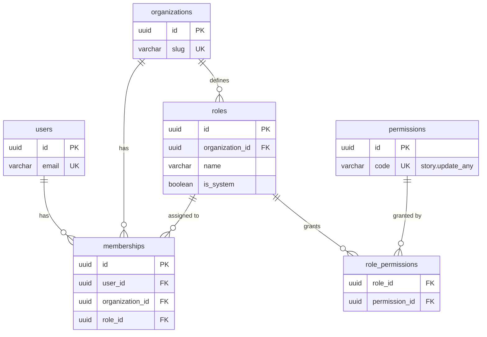
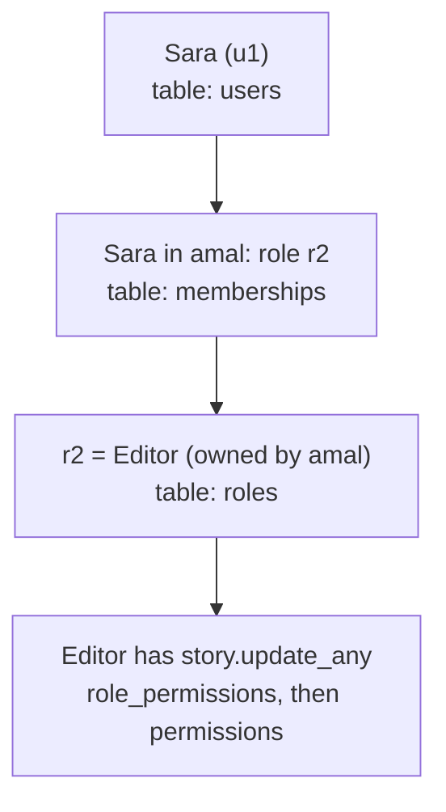

# الدرس ٧: RBAC Design

**RBAC:** اختصار لعبارة Role-Based Access Control، ومعناها "التحكم بالوصول حسب الدور".

> **ملاحظة:** هذا الملف يدمج الشرح الأول لهذا الدرس مع إعادة الشرح التي جاءت بعده، في درس واحد مرتب. المخطط هنا هو المخطط المصحح الذي يُظهر السلسلة كاملة حتى جدول المستخدمين.

## المستوى البسيط

### الفكرة

في المستشفى، لا يكتب المدير قائمة بالأبواب التي يفتحها كل موظف على حدة. بل يقول: "بطاقة الطبيب تفتح غرف العمليات والعيادات، وبطاقة الممرض تفتح الأجنحة". ثم يعطي كل موظف بطاقة دوره.

وفي نظامنا ثلاثة مفاهيم:

- **Permission:** الصلاحية، وهي فعل واحد محدد، مثل "حذف أي قصة" أو "دعوة عضو".
- **Role:** الدور، وهو مجموعة صلاحيات لها اسم، مثل "مدير".
- **Membership:** العضوية، وهي التي تربط الشخص بدوره داخل مؤسسة معيّنة، كما تعلمنا في الدرس الأول.

### طريقة كتابة الصلاحيات

تُكتب الصلاحية عادة بصيغة "الشيء ثم الفعل":

- **story.create:** إنشاء قصة.
- **story.update_own:** تعديل قصصي فقط.
- **story.update_any:** تعديل أي قصة في المدرسة.
- **member.invite:** دعوة عضو.
- **billing.manage:** إدارة الاشتراك والدفع.

### التصميم الأول: أدوار ثابتة

الأدوار الأربعة من المرحلة الأولى، وصلاحياتها مكتوبة في الكود:

| الصلاحية | Owner | Admin | Member | Viewer |
|---|---|---|---|---|
| story.create | ✅ | ✅ | ✅ | ❌ |
| story.update_own | ✅ | ✅ | ✅ | ❌ |
| story.update_any | ✅ | ✅ | ❌ | ❌ |
| member.invite | ✅ | ✅ | ❌ | ❌ |
| billing.manage | ✅ | ❌ | ❌ | ❌ |

هذا التصميم بسيط، وتبدأ به أغلب المنتجات. والدور هنا مجرد قيمة نصية في جدول العضويات، كما رسمناه في الدرس الأول.

### التصميم الثاني: أدوار تصنعها المؤسسة

مع نمو العملاء، تطلب مدرسة كبيرة: "نريد دوراً اسمه محرر، يستطيع تعديل أي قصة، لكنه لا يستطيع دعوة أعضاء". هذا الدور غير موجود في الجدول أعلاه. والحل أن تنتقل الأدوار من الكود إلى قاعدة البيانات.

وهذا المخطط كاملاً، بدءاً من المستخدمين:



**الجديد مقارنة بالدرس الأول جدولان فقط:**

- **الأدوار:** أسماء الأدوار التي تعرّفها كل مدرسة.
- **الصلاحيات:** قائمة الأفعال الممكنة.

وبينهما جدول وسيط صغير يربط كل دور بصلاحياته، مثل جدول عناصر الطلب في DRF_Core تماماً. وجدول العضويات صار يحمل معرّف دور، بدل الدور النصي الذي رسمناه في الدرس الأول.

**طبّق اختبار الدرس الثاني على كل جدول:**

- **الصلاحيات من جداول المنصة.** إذا حُذفت مدرسة، تبقى الصلاحيات. والسبب الأعمق أن كل صلاحية تقابلها أسطر في الكود تفحصها. فالمدرسة لا تستطيع اختراع صلاحية جديدة لا يعرفها الكود.
- **الأدوار من جداول المستأجر.** دور "محرر" في مدرسة الأمل يُحذف مع الأمل، ولا تراه مدرسة النور أبداً.

**وعمود is_system:** يميّز الأدوار الأساسية التي ينشئها النظام عند تجهيز المدرسة، وأهمها دور المالك. فهذه لا يجوز حذفها، ولا تعديلها بحرية.

### بيانات حقيقية

**المستخدمون:**

| المعرّف | الاسم |
|---|---|
| u1 | سارة |

**المؤسسات:**

| المعرّف | المدرسة |
|---|---|
| o1 | الأمل |
| o2 | النور |

**الأدوار، وكل دور يتبع مدرسة:**

| المعرّف | المدرسة | اسم الدور |
|---|---|---|
| r1 | الأمل | Admin |
| r2 | الأمل | Editor |
| r3 | النور | Member |

**الصلاحيات:**

| المعرّف | الصلاحية |
|---|---|
| p1 | story.create |
| p2 | story.update_any |
| p3 | member.invite |

**صلاحيات كل دور:**

| الدور | الصلاحية |
|---|---|
| r2 (Editor) | p1 (story.create) |
| r2 (Editor) | p2 (story.update_any) |
| r3 (Member) | p1 (story.create) |

**العضويات:**

| المستخدم | المدرسة | الدور |
|---|---|---|
| u1 (سارة) | o1 (الأمل) | r2 (Editor) |
| u1 (سارة) | o2 (النور) | r3 (Member) |

### نتتبع سارة

**السؤال:** هل تستطيع سارة تعديل أي قصة في مدرسة الأمل؟

نمشي خلف السهم من جدول إلى جدول:



1. **جدول المستخدمين:** نبدأ بسارة، ومعرّفها u1.
2. **جدول العضويات:** نبحث عن الصف الذي فيه سارة مع مدرسة الأمل، فنجد أن دورها هو r2.
3. **جدول الأدوار:** الدور r2 اسمه Editor، ويتبع مدرسة الأمل.
4. **جدول صلاحيات الأدوار:** الدور r2 يحمل الصلاحيتين p1 و p2. والصلاحية p2 هي story.update_any.

**الجواب: نعم.**

**والآن السؤال نفسه في مدرسة النور:** العضوية هناك تشير إلى الدور r3، و r3 لا يحمل إلا الصلاحية p1، أي إنشاء القصص فقط. **الجواب: لا.**

الشخص واحد، والسؤال واحد، والجواب مختلف. والسبب أن الطريق يمر دائماً **عبر العضوية**، والعضوية تختلف من مدرسة لأخرى. هذه هي الفكرة كلها.

## المستوى المتوسط: افحص الصلاحية، لا اسم الدور

هذه هي الفكرة التي تجعل الانتقال من التصميم الأول إلى الثاني سهلاً.

**الطريقة الخاطئة:** أن يسأل الكود في كل مكان: "هل دور هذا الشخص هو المدير؟"
**الطريقة الصحيحة:** أن يسأل: "هل يملك هذا الشخص صلاحية story.update_any؟"

**لماذا؟** لأن دور "المحرر" الجديد ليس مديراً، لكنه يملك صلاحية تعديل أي قصة. الكود الذي يسأل عن اسم الدور سيمنعه خطأً، وستضطر للبحث عن كل مكان سألت فيه وتعديله. أما الكود الذي يسأل عن الصلاحية فسيعمل مع أي دور جديد، دون تغيير سطر واحد.

**هل تتذكر هذه الفكرة؟** هي نفسها فكرة الدرس السابع من المرحلة الأولى: "لا تسأل عن اسم الخطة، بل عن الاستحقاق". ونفس فكرة visible_to: سؤال واحد في مكان واحد.

**نصيحتي العملية:** حتى مع الأدوار الثابتة، اكتب الفحص من البداية على شكل سؤال عن الصلاحية. فيصبح الانتقال إلى الأدوار المخصصة لاحقاً تغييراً في مكان واحد فقط.

### "قصصي" أم "أي قصة"؟

لاحظ الفرق بين story.update_own و story.update_any. الأولى تحتاج فحصين:

1. **هل يملك الشخص صلاحية تعديل قصصه؟** هذا سؤال عن الدور.
2. **هل هذه القصة قصته فعلاً؟** هذا سؤال عن الكائن نفسه.

وأنت تعرف الفحص الثاني جيداً: هو صلاحية الكاتب التي بنيتها في StoryHub على مستوى الكائن. الجديد فقط أنها صارت مرتبطة بدور داخل مؤسسة.

## المستوى العميق

### صلاحيات Django المدمجة لا تكفي هنا

Django فيه نظام صلاحيات ومجموعات جاهز، وقد تفكر في استعماله. لكن انتبه: صلاحيات Django مرتبطة بالمستخدم على مستوى المنصة كلها. فلو أعطيت سارة صلاحية "تعديل أي قصة"، فستملكها في كل مدرسة هي عضوة فيها. بينما نحتاج أن تكون مديرة في الأمل وعضوة عادية في النور.

لذلك تبني الأنظمة متعددة المستأجرين نظام أدوارها بنفسها، مرتبطاً بالعضوية. وهذا بالضبط ما رسمناه.

### الترقية الذاتية: ثغرة يجب منعها

مدير في مدرسة الأمل يملك صلاحية إنشاء الأدوار، لكنه لا يملك صلاحية إدارة الدفع. فينشئ دوراً جديداً يحتوي إدارة الدفع، ثم يعطيه لنفسه. وهكذا رفع صلاحياته بنفسه.

**القاعدة التي تمنع ذلك:** لا تستطيع أن تمنح صلاحية لا تملكها أنت. أي دور ينشئه شخص أو يعدّله، يجب أن تكون صلاحياته جزءاً من صلاحيات ذلك الشخص نفسه.

**Privilege Escalation:** هو اسم هذه الثغرة، ويعني "تصعيد الصلاحيات".

### القرار النهائي يمر بثلاثة أسئلة

عندما يضغط مدير الأمل زر "تصدير البيانات"، يسأل النظام:

1. **هل تسمح خطة المدرسة بالتصدير؟** وهذا هو الاستحقاق من الدرس السابع في المرحلة الأولى.
2. **هل يملك دور هذا الشخص صلاحية التصدير؟** وهذا موضوع اليوم.
3. **إن كان الفعل على كائن معيّن، فهل يحق له هذا الكائن تحديداً؟** مثل "قصصي فقط".

ويجب أن تكون الإجابة "نعم" في الأسئلة الثلاثة كلها.

### ماذا يفعل السوق؟

الأدوار المخصصة تُقدَّم غالباً كميزة في الخطط الغالية، فهي نفسها استحقاق. والتوصية:

- **النظام الجديد أو الصغير:** أدوار ثابتة، مع فحص بالصلاحية من البداية.
- **النظام الذي يطلب عملاؤه أدواراً خاصة:** أدوار مخصصة، تُقدَّم كميزة في الخطط الأغلى.

---

## الخلاصة

الصلاحية فعل محدد، والدور مجموعة صلاحيات، والعضوية تربط الشخص بدوره داخل مؤسسة. ابدأ بأدوار ثابتة، وانتقل إلى أدوار تصنعها المؤسسة عند الحاجة: الصلاحيات تبقى جداول منصة، والأدوار تصبح جداول مستأجر. والطريق إلى أي صلاحية يمر دائماً عبر العضوية، والكود يسأل عن الصلاحية لا عن اسم الدور، ولا يسمح لأحد بمنح صلاحية لا يملكها.

## سؤال فهم (الإجابة اختيارية)

عضو في مدرسة النور، وبسبب خطأ في الكود، صار في عضويته الدور r2، أي Editor الخاص بمدرسة الأمل. أي أداة من دروس هذه المرحلة تجعل قاعدة البيانات نفسها ترفض هذا؟ وكيف؟

**تلميح:** اكتب صف هذه العضوية الخاطئة كما في الجداول أعلاه: المدرسة هي o2، والدور هو r2. ثم انظر في جدول الأدوار: لأي مدرسة يتبع r2؟ صار عندنا صف في مدرسة يشير إلى صف في مدرسة أخرى. في أي درس من هذه المرحلة رأينا هذه المشكلة نفسها بالضبط، مع القصة والتصنيف؟

## الدرس التالي

**الدرس ٨، Billing Schema:** جداول الخطط والاشتراكات والحدود، ومخطط حالات الاشتراك الذي رأيته في المرحلة الأولى، وقد صار جداول حقيقية.

---

## مراجعة إجابة سؤال الفهم

> **إجابتك:** الدرس الثالث، المفتاح الأجنبي المركّب (اتذكر طبقنا الشرح لفكرة التصنيفات بين المدارس, هل هنا نستخدم نفس الأمر مع الأدوار والصلاحيات والعضويات (هيك الترتيب صح كيف يكون شكل المفتاح الأجنبي وكيف يتكون ممن هم الأعمدة ؟) ؟ )

**إجابتك صحيحة: المفتاح الأجنبي المركّب من الدرس الثالث.** وهو الحل نفسه الذي طبقناه على القصة والتصنيف.

**أين نضعه بالضبط؟ على جدول العضويات فقط.** لأن العضوية هي الصف الذي يشير إلى دور، والدور يتبع مدرسة:

```sql
-- roles: allow the pair (organization_id, id) to be referenced
ALTER TABLE roles ADD UNIQUE (organization_id, id);

-- memberships: the role must belong to the membership's own school
ALTER TABLE memberships
    ADD FOREIGN KEY (organization_id, role_id)
    REFERENCES roles (organization_id, id);
```

**الأعمدة:**

- **من جهة العضوية:** عمود المؤسسة وعمود الدور.
- **من جهة الأدوار:** عمود المؤسسة والمعرّف.

فالعضوية الخاطئة، أي النور مع الدور r2، تبحث عن الزوج "النور مع r2" في جدول الأدوار، ولا تجده، فتُرفض.

**ولماذا لا نحتاجه في جدول صلاحيات الأدوار؟** لأن الصلاحيات جداول منصة لا تتبع أي مدرسة. فلا يوجد "جدار" يمكن القفز فوقه هناك.
