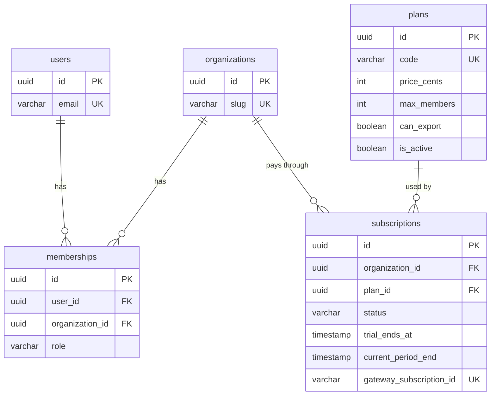

# الدرس ٨: Billing Schema

في الدرس السابع من المرحلة الأولى تعلمنا الأفكار: الخطة، والاشتراك، وحالاته، والاستحقاقات. اليوم نحوّلها إلى جداول. **والجديد جدولان فقط:** الخطط، والاشتراكات.

## المستوى البسيط: المخطط

ومعه السلسلة كاملة حتى المستخدمين:

**اتبع السلسلة من الأعلى:** المستخدم يصل إلى المدرسة عبر العضوية، كما تعرف. ثم المدرسة لها اشتراكات، وكل اشتراك يشير إلى خطة واحدة.

### جدول الخطط: جدول منصة

طبّق اختبار الدرس الثاني: إذا حُذفت مدرسة الأمل، هل تُحذف الخطة "المتقدمة"؟ لا، فهي لكل المدارس. إذن الخطط من جداول المنصة.

أعمدته:

- **code:** اسم برمجي ثابت للخطة، مثل basic أو pro.
- **price_cents:** السعر.
- **max_members و can_export:** هذه هي **الاستحقاقات** من المرحلة الأولى، وقد صارت أعمدة. الأولى حد لعدد الأعضاء، والثانية هل التصدير مسموح.
- **is_active:** هل الخطة معروضة للمشتركين الجدد.

### جدول الاشتراكات: جدول مستأجر

اختبار الحذف: إذا حُذفت مدرسة الأمل، يُحذف اشتراكها معها. إذن هو جدول مستأجر، ويحمل عمود المؤسسة. لكن تذكّر من الدرس الثاني: الملكية شيء، والكتابة شيء آخر. المدرسة لا تعدّل حالة اشتراكها بنفسها أبداً، بل بوابة الدفع هي التي تغيّرها.

أعمدته:

- **status:** الحالة، من مخطط الحالات الذي رأيته في المرحلة الأولى: trialing، ثم active، ثم past_due، ثم canceled.
- **trial_ends_at:** متى تنتهي الفترة التجريبية.
- **current_period_end:** متى ينتهي الشهر المدفوع الحالي.
- **gateway_subscription_id:** معرّف هذا الاشتراك عند بوابة الدفع. فعندما تصل رسالة من البوابة، نعرف بهذا العمود أي اشتراك تقصد.

## المستوى المتوسط: بيانات حقيقية وتتبع

**الخطط:**

| المعرّف | code | السعر | max_members | can_export |
|---|---|---|---|---|
| pl1 | basic | ٠ | ١٠ | لا |
| pl2 | pro | ٤٠ دولاراً | ٥٠ | نعم |

**الاشتراكات:**

| المعرّف | المدرسة | الخطة | status | ملاحظة |
|---|---|---|---|---|
| s1 | الأمل | pl1 | canceled | اشتراكها القديم قبل الترقية |
| s2 | الأمل | pl2 | active | ينتهي شهره في ٣ نوفمبر |
| s3 | النور | pl1 | trialing | تنتهي تجربتها في ١٧ أكتوبر |

**لاحظ أن الأمل لها صفّان.** عندما رقّت خطتها، لم نعدّل الصف القديم، بل ألغيناه وأنشأنا صفاً جديداً. وبهذا يبقى تاريخ المدرسة محفوظاً: متى اشتركت، ومتى رقّت.

**السؤال:** مدرسة الأمل فيها الآن ١٢ عضواً. هل تستطيع دعوة عضو جديد؟

نتتبع السلسلة:

1. **جدول الاشتراكات:** نبحث عن اشتراك الأمل غير الملغى، فنجد s2، وحالته active.
2. **جدول الخطط:** الاشتراك s2 يشير إلى الخطة pl2، وحدها الأقصى ٥٠ عضواً.
3. **جدول العضويات:** نعدّ أعضاء الأمل الحاليين، فنجد ١٢.
4. **المقارنة:** ١٢ أقل من ٥٠. **الجواب: نعم.**

**ونفس السؤال لمدرسة النور:** اشتراكها s3 تجريبي، ويشير إلى pl1، وحدها ١٠ أعضاء. والجواب يعتمد على عدد أعضاء النور الحاليين.

**وسؤال آخر: هل تستطيع النور التصدير؟** الاشتراك s3، ثم الخطة pl1، ثم العمود can_export يقول "لا". **الجواب: لا.**

**لاحظ أن الكود لم يسأل أبداً "ما اسم خطة هذه المدرسة؟"** بل سأل عن الحد وعن الصلاحية مباشرة. هذا هو مبدأ الاستحقاقات من المرحلة الأولى، وقد صار عموداً في جدول.

## المستوى العميق

### اشتراك واحد فعّال لكل مدرسة

يجب ألا يكون لمدرسة اشتراكان فعّالان في الوقت نفسه، وإلا فأي حد نطبّق؟ لكن يجب أيضاً أن نسمح بصفوف ملغاة كثيرة، لأنها التاريخ.

**الحل:** قيد فريد مشروط، رأيت فكرته في الدرس الثالث مع الحذف الناعم. القيد يقول: "عمود المؤسسة فريد، **بين الصفوف غير الملغاة فقط**".

### السعر رقم صحيح بالسنتات

لاحظ أن السعر ٤٠ دولاراً يُحفظ كرقم صحيح هو ٤٠٠٠ سنت. لا نستعمل الأرقام العشرية العادية للمال أبداً، لأنها تنتج أخطاء تقريب صغيرة. وأخطاء التقريب في الفواتير تصبح مشاكل حقيقية مع آلاف العملاء.

### لا تعدّل سعر خطة عليها مشتركون

لنفترض أنك قررت رفع سعر الخطة المتقدمة إلى ٥٠ دولاراً. لو عدّلت الصف نفسه، سيتغير السعر فجأة على كل المشتركين الحاليين، دون اتفاق معهم.

**الطريقة الصحيحة:** تنشئ خطة جديدة بالسعر الجديد، وتجعل القديمة غير معروضة، بقيمة "لا" في عمود is_active. المشتركون الجدد يرون الخطة الجديدة، والقدامى يبقون على سعرهم.

### أين الحقيقة؟

حالة الدفع الحقيقية موجودة عند بوابة الدفع. أما جدولنا فهو نسخة منها، تُحدَّث كلما وصلت رسالة من البوابة. وهنا أمران:

- **الرسالة قد تصل مرتين.** البوابات تعيد الإرسال إذا تأخر ردك. لذلك تُحفظ معرّفات الرسائل التي عالجتها، ولا تُعالج الرسالة نفسها مرتين. وهذا سيحتاج جدولاً صغيراً ثالثاً، نتركه للمشروع الكبير.
- **الرسالة قد لا تصل أبداً.** لذلك لا تعتمد على عمود الحالة وحده. إذا كانت الحالة active، لكن تاريخ نهاية الشهر قد مضى، فهذا يعني أن شيئاً ما فاتك. تعامل معها كأنها past_due، أي أعطِ مهلة، وتحقق من البوابة.

### فخ ينتظرنا في الدرس القادم

الأمل فيها ٤٩ عضواً، والحد ٥٠. مديران يدعوان عضواً في اللحظة نفسها بالضبط. كل واحد منهما يعدّ فيجد ٤٩، فيسمح. النتيجة ٥١ عضواً. وهذا موضوع الدرس التاسع.

---

## الخلاصة

الفوترة تحتاج جدولين: الخطط، وهي جدول منصة يحمل السعر والاستحقاقات كأعمدة، والاشتراكات، وهي جدول مستأجر يربط المدرسة بخطة ويحمل الحالة والتواريخ ومعرّف البوابة. نحتفظ بالاشتراكات القديمة كتاريخ، مع قيد يسمح باشتراك فعّال واحد فقط. والمال يُحفظ بالسنتات، والخطط المستعملة لا تُعدَّل أسعارها. وعند السؤال عن حد، نتتبع: المدرسة، ثم اشتراكها الفعّال، ثم خطته، ثم العمود.

## سؤال فهم (الإجابة اختيارية)

مدرسة النور في فترتها التجريبية، والتجربة تنتهي في ١٧ أكتوبر. اليوم ٢٠ أكتوبر، ولم تدفع، ولم تصل أي رسالة من بوابة الدفع، فما زال عمود الحالة يقول trialing. ماذا يجب أن يفعل النظام عندما يدخل أحد أعضائها؟

## الدرس التالي

**الدرس ٩، Concurrency & Quotas:** فخ المديرين اللذين يدعوان في اللحظة نفسها، وكيف تمنعه الأقفال. وهذا يُكمل موضوع الأقفال المؤجل من دورة PostgreSQL.

---

## مراجعة إجابة سؤال الفهم

> **إجابتك:** يعطيها مهلة ويعاملها كأنها past_due وممكن ان يتم تجميد المعاملات داخل المؤسسة وجعل الامر مشاهده مثلا

**صحيحة، وفكرة التجميد ممتازة.** مع تدقيق صغير: المدرسة في التجربة لم تدفع أصلاً، وغالباً لم تضع بطاقة. لذلك الأدق أن نسميها **"تجربة منتهية"** لا "متأخرة الدفع". والسلوك هو ما اقترحته بالضبط: وضع المشاهدة فقط، مع رسالة واضحة تدعو المدرسة للاشتراك.

**والنقطة الأهم:** النظام عرف ذلك من **مقارنة التاريخ**، لا من عمود الحالة. وفي التطبيق تُضاف مهمة Celery دورية تعمل كل يوم، تبحث عن التجارب المنتهية، وتحدّث حالتها.
