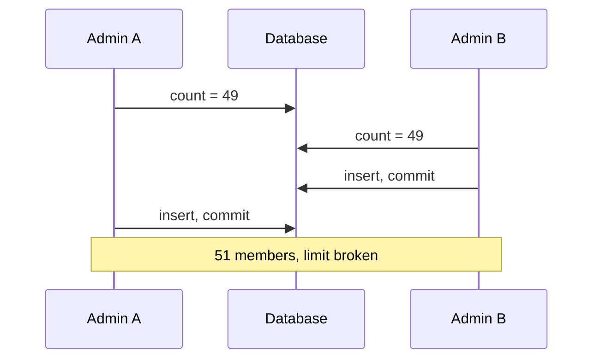
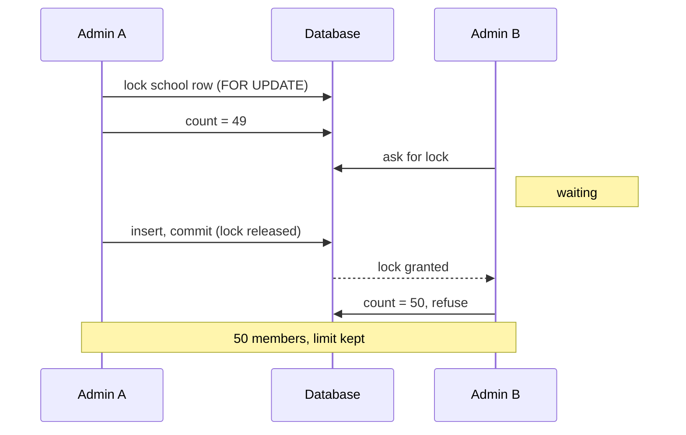

# الدرس ٩: Concurrency & Quotas

**Concurrency:** تعني "التزامن"، أي أن تحدث عمليتان في الوقت نفسه.
**Quota:** تعني "الحصة" أو "الحد"، مثل الحد الأقصى للأعضاء.

## المستوى البسيط: حالة السباق

**التشبيه:** حفلة بقي فيها مقعد واحد. موظفا تذاكر في شباكين مختلفين، وكل واحد أمامه زبون. في اللحظة نفسها:

1. **الموظف الأول ينظر في القائمة:** "بقي مقعد واحد". فيبدأ البيع.
2. **الموظف الثاني ينظر في القائمة:** "بقي مقعد واحد". فيبدأ البيع.
3. **النتيجة:** تذكرتان لمقعد واحد.

لم يخطئ أي منهما في الحساب. المشكلة أن كل واحد **فحص ثم تصرّف**، وبين الفحص والتصرف دخل الآخر.

**Race Condition:** هو اسم هذه المشكلة، ويعني "حالة سباق".

**وفي نظامنا:** الكود الطبيعي لدعوة عضو يقول: "عُدّ الأعضاء، فإذا كانوا أقل من الحد، أضف العضو". هذا بالضبط "افحص ثم تصرّف".

## المستوى المتوسط: التجربة على جهازك

أنشأت قاعدة البيانات المؤقتة saas_lab، ووضعت فيها مدرسة الأمل ومعها ٤٩ عضواً، والحد ٥٠. ثم شغّلت **جلستين في الوقت نفسه**، كأنهما مديران يضغطان زر الدعوة معاً. وفي النهاية حذفت قاعدة البيانات.

وهذا رسم للتجربتين قبل أن نقرأ النتائج.

**بدون قفل:**



**مع قفل على صف المدرسة:**



### التجربة الأولى: بدون قفل

المدير A يعدّ، ثم يتأخر ثانيتين، كأن الكود يجهّز شيئاً، ثم يضيف. والمدير B يبدأ بعده بنصف ثانية:

```
-- admin A
saas_lab=> BEGIN;
BEGIN
saas_lab=> SELECT count(*) FROM memberships WHERE organization_id = 1;
 count
-------
    49
(1 row)

saas_lab=> SELECT pg_sleep(2);
saas_lab=> INSERT INTO memberships (organization_id, user_name) VALUES (1, 'invited_by_admin_A');
INSERT 0 1
saas_lab=> COMMIT;
COMMIT

-- admin B
saas_lab=> BEGIN;
BEGIN
saas_lab=> SELECT count(*) FROM memberships WHERE organization_id = 1;
 count
-------
    49
(1 row)

saas_lab=> INSERT INTO memberships (organization_id, user_name) VALUES (1, 'invited_by_admin_B');
INSERT 0 1
saas_lab=> COMMIT;
COMMIT

-- after both
saas_lab=> SELECT count(*) FROM memberships WHERE organization_id = 1;
 count
-------
    51
(1 row)
```

**كل مدير رأى ٤٩، فقرر أن الإضافة مسموحة. والنتيجة ٥١ عضواً، والحد ٥٠.** لاحظ أن المعاملة وحدها لم تحمِنا. فالمعاملة تضمن أن عمليات المدير الواحد تتم كلها أو لا شيء منها، لكنها لا تمنع مديراً آخر من القراءة في الوقت نفسه.

### التجربة الثانية: مع قفل على صف المدرسة

**FOR UPDATE:** إضافة إلى جملة SELECT، تعني: "اقرأ هذا الصف، واحجزه لي حتى تنتهي معاملتي". وأي جلسة أخرى تطلب الحجز نفسه تنتظر في الطابور.

```
-- admin A
saas_lab=> BEGIN;
BEGIN
saas_lab=> SELECT id FROM organizations WHERE id = 1 FOR UPDATE;
 id
----
  1
(1 row)

saas_lab=> SELECT count(*) FROM memberships WHERE organization_id = 1;
 count
-------
    49
(1 row)

saas_lab=> SELECT pg_sleep(2);
saas_lab=> INSERT INTO memberships (organization_id, user_name) VALUES (1, 'invited_by_admin_A');
INSERT 0 1
saas_lab=> COMMIT;
COMMIT

-- admin B
saas_lab=> BEGIN;
BEGIN
saas_lab=> SELECT to_char(clock_timestamp(), 'HH24:MI:SS.MS') AS asked_for_lock;
 asked_for_lock
----------------
 10:33:27.751
(1 row)

saas_lab=> SELECT id FROM organizations WHERE id = 1 FOR UPDATE;
 id
----
  1
(1 row)

saas_lab=> SELECT to_char(clock_timestamp(), 'HH24:MI:SS.MS') AS got_lock;
   got_lock
--------------
 10:33:29.218
(1 row)

saas_lab=> SELECT count(*) FROM memberships WHERE organization_id = 1;
 count
-------
    50
(1 row)

saas_lab=> ROLLBACK;
ROLLBACK

-- after both
saas_lab=> SELECT count(*) FROM memberships WHERE organization_id = 1;
 count
-------
    50
(1 row)
```

**قراءة النتيجة:**

- **المدير B طلب القفل** عند الثانية ٢٧.٧٥١، **وحصل عليه** عند ٢٩.٢١٨. أي أنه انتظر قرابة ثانية ونصف، حتى أنهى A معاملته.
- **بعد الانتظار عدّ B فوجد ٥٠**، لأن إضافة A صارت مؤكدة. فرفض الكود الدعوة، وأُلغيت المعاملة.
- **النتيجة النهائية ٥٠.** الحد محفوظ.

### لماذا نقفل صف المدرسة، لا صفوف العضويات؟

القاعدة تخص المدرسة كلها: "عدد أعضاء الأمل لا يتجاوز ٥٠". ولا يوجد صف عضوية واحد يمثل هذا العدد. أما صف المدرسة فهو **الباب** الذي يجب أن تمر منه كل دعوة لهذه المدرسة.

**والفائدة في نظام متعدد المستأجرين:** القفل على صف الأمل وحده. فدعوات مدرسة النور لا تنتظر أبداً. كل مدرسة لها طابورها الخاص.

**في Django:** هذه الأداة اسمها select_for_update، وتعمل داخل transaction.atomic التي تعرفها.

## المستوى العميق

### اجعل القفل قصيراً

القفل يبقى حتى نهاية المعاملة. وكل دعوة أخرى للمدرسة نفسها تنتظره. لذلك لا تضع داخل المعاملة شيئاً بطيئاً، مثل إرسال بريد الدعوة.

**الحل الذي يناسب خبرتك:** أنهِ المعاملة أولاً، ثم أرسل البريد عبر Celery. وفي Django أداة اسمها transaction.on_commit تشغّل الكود فقط بعد نجاح المعاملة. وهذا يحميك أيضاً من إرسال بريد دعوة ثم إلغاء المعاملة.

### الأداة نفسها تحل مشكلة المالك الأخير

تذكّر الفخ من الدرس الأول: مالكان يخفض كل منهما دور الآخر في اللحظة نفسها، فتبقى المدرسة بلا مالك. الحل هو نفسه: كل تغيير للأدوار يبدأ بقفل صف المدرسة. فيأتي التغيير الثاني بعد الأول، ويرى أن مالكاً واحداً فقط بقي، فيرفض.

### بدائل موجودة

- **عدّاد في صف المدرسة:** تحديث واحد يقول "زِد العدد بواحد، **بشرط** أن يكون أقل من ٥٠". فإذا لم يتغير أي صف، فالحد ممتلئ. هذا سريع، لكنه يحتاج عموداً إضافياً يجب أن يبقى صحيحاً دائماً.
- **مستوى عزل أعلى للمعاملات:** موجود في PostgreSQL، لكنه أثقل، ويحتاج إعادة محاولة عند الفشل.

**اختيارنا:** قفل صف المدرسة، لأنه الأوضح والأسهل في الفهم والاختبار.

### قاعدة تمنع التعارض بين الأقفال

إذا احتاجت عملية واحدة أكثر من قفل، فاقفل دائماً **بالترتيب نفسه**: صف المدرسة أولاً، ثم ما بعده. وإلا قد تنتظر عمليتان كل منهما الأخرى إلى الأبد.

**Deadlock:** هو اسم هذه الحالة، ويعني "الجمود" أو "القفل الميت". وPostgreSQL يكتشفه ويلغي إحدى العمليتين، لكن الأفضل ألا يحدث أصلاً.

---

## الخلاصة

"افحص ثم تصرّف" مع حد مثل عدد الأعضاء يقع في حالة سباق: عمليتان تريان العدد نفسه وتتجاوزان الحد معاً، والمعاملة وحدها لا تمنع ذلك. الحل أن تبدأ كل عملية بقفل صف المدرسة، فتصطف العمليات خلف بعضها، وكل مدرسة لها طابورها المستقل. واجعل القفل قصيراً، وأرسل البريد بعد نجاح المعاملة، واقفل دائماً بالترتيب نفسه.

## سؤال فهم (الإجابة اختيارية)

في اللحظة التي يقفل فيها مدير الأمل صف مدرسته، يضغط مدير مدرسة النور زر الدعوة. هل ينتظر مدير النور حتى ينتهي مدير الأمل؟ ولماذا؟

## الدرس التالي

**الدرس ١٠، Operational Tables:** جدولان جديدان فقط: الدعوات، وسجل التدقيق. ومعهما عمود الحذف الناعم وكيف نحذف مدرسة كاملة.

---

## مراجعة إجابة سؤال الفهم

> **إجابتك:** لا ينتظر، لأن القفل على صف الأمل فقط.

**إجابة صحيحة ودقيقة.** القفل على صف الأمل وحده، فلكل مدرسة طابورها، ولا تنتظر مدرسة أخرى.
