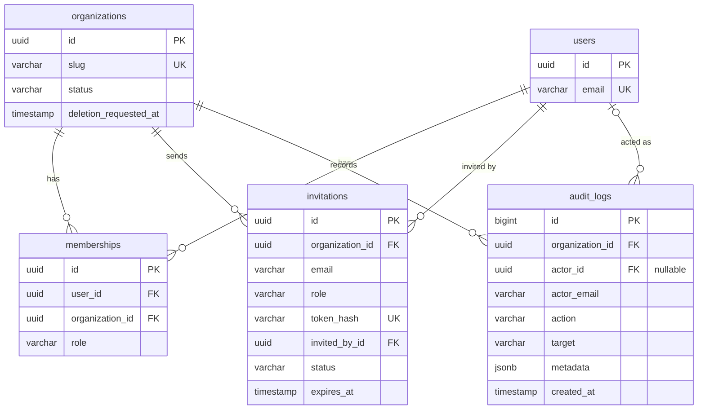
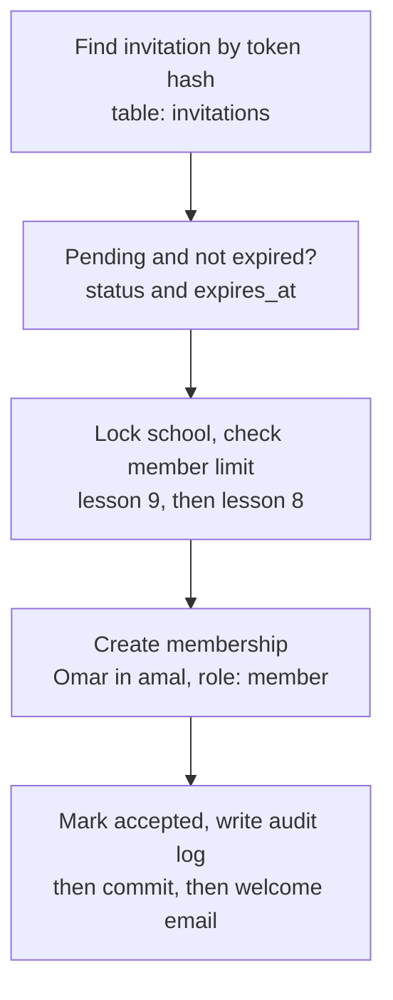

# الدرس ١٠: Operational Tables

**Operational:** تعني "تشغيلية"، أي الجداول التي تخدم تشغيل المنصة يوماً بيوم، لا محتوى المدارس نفسه.

**الجديد جدولان فقط:** الدعوات، وسجل التدقيق. ومعهما فكرة الحذف الكامل لمدرسة.

## المستوى البسيط: المخطط

والسلسلة كاملة حتى المستخدمين:



### جدول الدعوات

**لماذا يحمل بريداً إلكترونياً، لا معرّف مستخدم؟** تذكّر من الدرس الخامس في المرحلة الأولى: الدعوة قد تُرسل إلى شخص ليس له حساب بعد. فلا يوجد مستخدم نشير إليه. لذلك نحفظ البريد، وعند قبول الدعوة نربطه بحساب.

أعمدته:

- **email و role:** من ندعو، وبأي دور سيدخل.
- **token_hash:** بصمة الرمز السري الموجود في رابط الدعوة. وسنشرح في المستوى العميق لماذا نحفظ البصمة لا الرمز نفسه.
- **invited_by_id:** من أرسل الدعوة.
- **status:** الحالة: pending أي تنتظر، أو accepted أي قُبلت، أو revoked أي ألغاها المدير، أو expired أي انتهت.
- **expires_at:** متى تنتهي صلاحية الرابط.

**طبّق اختبار الدرس الثاني:** إذا حُذفت مدرسة الأمل، تُحذف دعواتها معها. إذن هو جدول مستأجر.

### جدول سجل التدقيق

- **actor_id:** من قام بالفعل. ويُسمح أن يكون فارغاً لسببين: أفعال يقوم بها النظام نفسه، مثل إنهاء تجربة، أو مستخدم حُذف حسابه لاحقاً.
- **actor_email:** نسخة نصية من بريد الفاعل، تُحفظ لحظة الفعل. فإذا حُذف حساب أحمد بعد سنة، يبقى السجل يقول من فعل ذلك.
- **action:** الفعل بصيغة ثابتة، مثل member.removed أو invitation.accepted.
- **target:** على من وقع الفعل.
- **metadata:** تفاصيل إضافية بأي شكل. ونوعه JSONB الذي درسته في الموضوع الثالث عشر من دورتك، لأن تفاصيل كل فعل تختلف عن غيره.

**وهو أيضاً جدول مستأجر:** يُحذف مع المدرسة، لكن المدرسة لا تستطيع تعديله، كما تعلمنا.

## المستوى المتوسط: بيانات حقيقية وتتبع

**الدعوات:**

| المعرّف | المدرسة | البريد | الدور | أرسلها | status | تنتهي |
|---|---|---|---|---|---|---|
| i1 | الأمل | omar@example.com | member | سارة | pending | ١١ أكتوبر |

**السؤال:** عمر يضغط رابط الدعوة. ماذا يحدث؟

نتتبع خطوة خطوة:



1. **البحث بالبصمة:** نحسب بصمة الرمز الموجود في الرابط، ونبحث عنها في جدول الدعوات، فنجد i1.
2. **الفحص:** الحالة pending، واليوم قبل ١١ أكتوبر. الدعوة صالحة.
3. **القفل والحد:** نقفل صف مدرسة الأمل، كما في الدرس التاسع، ثم نتحقق من حد الأعضاء في خطتها، كما في الدرس الثامن. **لماذا هنا أيضاً؟** لأن المدرسة ربما امتلأت بين لحظة إرسال الدعوة ولحظة قبولها.
4. **العضوية:** نجد حساب عمر أو ننشئه، ثم ننشئ عضويته في الأمل بالدور المكتوب في الدعوة.
5. **الإغلاق:** نغيّر حالة الدعوة إلى accepted، ونكتب سطراً في سجل التدقيق.

**كل الخطوات داخل معاملة واحدة.** فإذا فشلت أي خطوة، لا يحدث شيء منها. وبعد نجاح المعاملة فقط، يُرسل بريد الترحيب عبر Celery، كما تعلمنا في الدرس السابق.

**وبعدها يصبح سجل التدقيق هكذا:**

| الوقت | الفاعل | الفعل | الهدف | التفاصيل |
|---|---|---|---|---|
| ١٠:٠٣ | sara@example.com | invitation.created | omar@example.com | {"role": "member"} |
| ١٠:٤١ | omar@example.com | invitation.accepted | omar@example.com | {"invitation": "i1"} |

## المستوى العميق

### لماذا نحفظ بصمة الرمز، لا الرمز نفسه؟

رمز الدعوة يعمل مثل كلمة مرور: من يملكه يدخل المدرسة. فلو حفظناه كما هو، ثم تسربت قاعدة البيانات يوماً، يستطيع المهاجم استعمال كل الدعوات المعلقة والدخول إلى المدارس.

**الحل:** نحفظ بصمته فقط. وعندما يصل الرابط، نحسب بصمة الرمز ونقارنها. وهي فكرة كلمات المرور نفسها: Django لا يحفظ كلمة مرورك، بل بصمتها.

### دعوة معلقة واحدة لكل بريد في كل مدرسة

لا معنى لثلاث دعوات معلقة إلى عمر في مدرسة الأمل. والحل قيد فريد مشروط، كما في الدرس الثالث: المدرسة مع البريد، بأحرف صغيرة، بين الدعوات المعلقة فقط. أما الدعوات المقبولة أو المنتهية القديمة، فتبقى كتاريخ.

### سجل التدقيق لا يُعدَّل، وقاعدة البيانات تضمن ذلك

قلنا في المرحلة الأولى إن السجل يُضاف إليه فقط. ويمكن أن تفرض قاعدة البيانات هذا بنفسها: الحساب الذي يتصل به التطبيق يُعطى صلاحية الإضافة والقراءة فقط على هذا الجدول، دون التعديل أو الحذف. وهذه فكرة الحساب غير المالك نفسها من الدرس السادس.

**وتذكّر من الدرس الرابع:** شاشة السجل تعرض أحدث الأفعال لمدرسة واحدة. إذن تحتاج فهرساً على المؤسسة ثم التاريخ. وهذا الجدول يكبر بسرعة كبيرة، لذلك يحتاج مدة حفظ معلنة، كما اتفقنا في إجابتك في المرحلة الأولى.

### حذف مدرسة كاملة

لا نحتاج جدولاً جديداً هنا، بل عموداً واحداً في المؤسسات: **deletion_requested_at**، أي متى طُلب الحذف.

1. **المالك يطلب الحذف:** تتحول الحالة إلى pending_deletion، ويُحفظ التاريخ. تختفي المدرسة من النظام، لكن بياناتها باقية.
2. **خلال ٣٠ يوماً:** يستطيع المالك التراجع.
3. **بعد ٣٠ يوماً:** مهمة Celery دورية تجد المدرسة، وتحذفها نهائياً.

**وكيف تُحذف كل البيانات؟** كل جدول مستأجر يحمل مفتاحاً أجنبياً إلى المؤسسات. فإذا جعلنا هذا المفتاح يحذف الصفوف المرتبطة معه، فحذف صف المدرسة يحذف كل شيء خلفه. وهذه هي الحالة الوحيدة المقصودة للحذف المتسلسل، كما قلنا في المرحلة الأولى.

**لكن في الواقع نحذف على دفعات:** مدرسة فيها مليون صف لا تُحذف في معاملة واحدة، لأن المعاملة الضخمة تقفل الجداول طويلاً وتبطئ المنصة على الجميع. فنحذف ألف صف، ثم ألفاً، حتى تنتهي. ثم الملفات المرفوعة، ثم مفاتيح الذاكرة المؤقتة.

---

## الخلاصة

جدول الدعوات يحفظ البريد لا المستخدم، لأن المدعو قد لا يملك حساباً، ويحفظ بصمة الرمز لا الرمز، ويسمح بدعوة معلقة واحدة لكل بريد في كل مدرسة. وقبول الدعوة معاملة واحدة: فحص، ثم قفل وحد، ثم عضوية، ثم سجل. وسجل التدقيق يحفظ نسخة من هوية الفاعل، وتمنع قاعدة البيانات تعديله. وحذف المدرسة يبدأ بطلب ومهلة، وينتهي بحذف متسلسل على دفعات.

## سؤال فهم (الإجابة اختيارية)

أرسل عمر رابط دعوته إلى صديقه خالد. خالد مسجّل دخوله بحسابه الخاص، وضغط الرابط. ماذا يجب أن يفعل النظام؟ وأي عمود في جدول الدعوات يساعده على القرار؟

## الدرس التالي

**الدرس ١١، Request Flow:** رسم رحلة الطلب كاملة: من الوسيط، إلى الاستعلام، إلى المهمة الخلفية والذاكرة المؤقتة، وأين تُحفظ معرفة المدرسة في كل خطوة.

---

## مراجعة إجابة سؤال الفهم

> **إجابتك:** مش عارف الإجابة حتى السؤال نفسة شوي صعب ومش مفهوم , قلي اجابتك بشكل بسيط ومفهوم

### الجواب ببساطة

**القصة:** سارة دعت عمر. فوصل إلى بريد عمر رابط الدعوة. لكن عمر أرسل الرابط إلى صديقه خالد. وخالد يملك حساباً خاصاً به على المنصة، ببريد مختلف.

**السؤال ببساطة:** هل يدخل خالد مدرسة الأمل لأنه يملك الرابط؟

**الجواب: لا.** سارة دعت **عمر** تحديداً، لا "أي شخص يملك الرابط".

**وكيف يعرف النظام ذلك؟** من **عمود البريد** في جدول الدعوات:

1. **الدعوة تقول:** هذه الدعوة للبريد omar@example.com.
2. **الشخص الذي ضغط الرابط** مسجّل دخوله ببريد khaled@example.com.
3. **البريدان مختلفان،** فيرفض النظام، ويعرض رسالة مثل: "هذه الدعوة مرسلة إلى بريد آخر".

**التشبيه:** بطاقة دعوة إلى حفل زفاف مكتوب عليها اسم "عمر". عند الباب، يطابق الحارس الاسم المكتوب على البطاقة مع هوية من يحملها. فلو جاء خالد بالبطاقة نفسها، لن يدخل.

**ولو لم نفحص البريد؟** أي رابط دعوة يُنشر في مجموعة واتساب، أو يُرسل بالخطأ، يُدخل الغرباء إلى المدرسة.

## سؤالك: ما معنى "بصمة الرمز"؟ هل هي التشفير؟

> **سؤالك:** ام آخر ايش يعني بصمة الرمز ؟ يعني التشفير ؟؟

**لا، هي شيء مختلف عن التشفير.** والفرق بسيط.

**التشفير يشبه صندوقاً بقفل:** تضع الرسالة داخله وتقفله. ومن يملك المفتاح يفتحه ويقرأ الرسالة الأصلية كما هي. إذن التشفير **طريق ذهاب وعودة**.

**البصمة تشبه بصمة الإصبع:** من إصبعك نستطيع أخذ بصمته. لكن من البصمة لا نستطيع صنع إصبعك. إذن البصمة **طريق ذهاب فقط**.

**Hash:** هو الاسم التقني للبصمة، و **Hashing** هو عملية أخذها.

**مثال حقيقي حُسب على جهازك:**

```
k7Qm2xR9vLp4 -> ba6d8c89028f1bab0de77f92...
k7Qm2xR9vLp5 -> 4c33a1abe8382016c6aa1fad...
```

لاحظ أمرين:

1. **الرمزان يختلفان في حرف واحد فقط** في آخرهما، لكن بصمتيهما مختلفتان تماماً.
2. **لا توجد طريقة** لتحويل البصمة ba6d8c... إلى الرمز k7Qm2xR9vLp4.

**كيف نستعملها في الدعوات؟**

1. **عند إرسال الدعوة:** يصنع النظام رمزاً عشوائياً، مثل k7Qm2xR9vLp4. يضعه في الرابط المرسل إلى عمر، ويحفظ **بصمته فقط** في قاعدة البيانات.
2. **عندما يضغط عمر الرابط:** يأخذ النظام الرمز من الرابط، ويحسب بصمته، ويبحث عنها في الجدول. فيجد الدعوة.
3. **لو سرق أحدهم قاعدة البيانات:** سيجد البصمة ba6d8c... فقط. وهي لا تنفعه، لأن النظام يطلب الرمز الأصلي في الرابط، ولا يمكن استخراج الرمز من البصمة.

**وأنت تستعمل هذا كل يوم دون أن تراه:** Django لا يحفظ كلمات مرور مستخدميك، بل بصماتها. ولهذا لا يستطيع حتى مدير الموقع معرفة كلمة مرور أي مستخدم.
