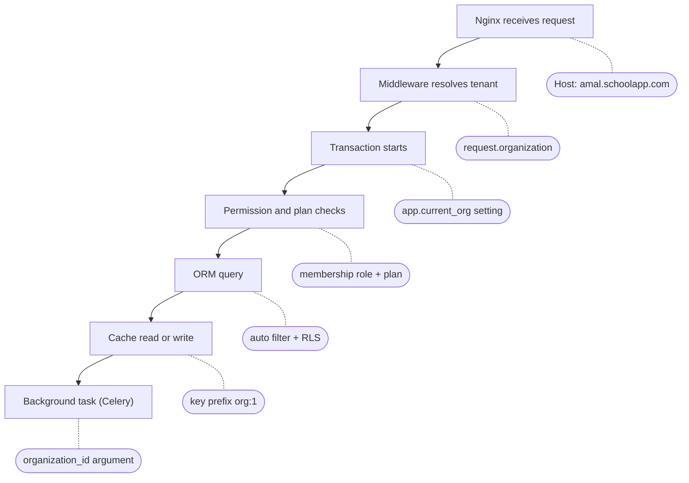

# الدرس ١١: Request Flow

**لا توجد جداول جديدة في هذا الدرس.** هو درس تجميعي: نرى كيف تعمل دروس المرحلة كلها معاً في طلب واحد.

## المستوى البسيط: معرفة المدرسة تنتقل عبر الطبقات

في المراجعة الختامية للمرحلة الأولى رسمنا رحلة الطلب كخطوات. اليوم نضيف سؤالاً جديداً لكل خطوة: **أين تُحفظ معرفة المدرسة هنا؟**

**Tenant Context:** تعني "سياق المستأجر"، أي المعلومة "هذا العمل لمدرسة الأمل"، وهي تنتقل من طبقة إلى طبقة.

**التشبيه:** جواز سفر. المسافر يمر بالمطار، ثم الطائرة، ثم مطار الوصول، ثم الفندق. وفي كل محطة يُطلب جوازه بشكل مختلف: ختم، أو بطاقة صعود، أو استمارة. والجواز يجب أن يرافقه في كل محطة، وإلا توقف عندها.

السهم الرئيسي يمثل رحلة الطلب، والصناديق الجانبية تقول أين تُحفظ معرفة المدرسة في كل خطوة:

## المستوى المتوسط: نمر على الطبقات واحدة واحدة

**المثال:** سارة تفتح صفحة "أحدث القصص" في مدرسة الأمل. ثم تنشر قصة جديدة، فيُرسل إشعار بالبريد لأعضاء المدرسة.

**الطبقة الأولى، Nginx:** يستقبل الطلب، ويمرر العنوان كما هو إلى Django. فمعرفة المدرسة هنا مجرد نص في الطلب: amal.schoolapp.com.

**الطبقة الثانية، الوسيط:** يقرأ amal من العنوان، ويجد المدرسة في جدول المؤسسات، ويتحقق من عضوية سارة النشطة، ومن أن المدرسة نفسها نشطة. ثم يعلّق المدرسة على كائن الطلب نفسه، فيصبح كل ما بعده قادراً على السؤال: "ما مدرسة هذا الطلب؟". وهذا ما بنيناه في الدرسين الأول والثاني من المرحلة الأولى.

**الطبقة الثالثة، بداية المعاملة:** أول ما يحدث داخلها ضبط إعداد قاعدة البيانات على مدرسة الأمل، وبشكل خاص بالمعاملة فقط. وهذا من الدرس السادس.

**الطبقة الرابعة، الفحوص:** هل يملك دور سارة صلاحية الفعل المطلوب؟ من الدرس السابع. وهل تسمح خطة المدرسة بذلك؟ من الدرس الثامن.

**الطبقة الخامسة، الاستعلام:** مدير الاستعلامات يضيف شرط المدرسة تلقائياً، وقاعدة البيانات تضيفه مرة أخرى كشبكة أمان، والفهرس الذي يبدأ بعمود المؤسسة يجعله سريعاً. وهذه الدروس الثاني والرابع والسادس معاً.

**الطبقة السادسة، الذاكرة المؤقتة:** إذا خزّنا قائمة أحدث القصص، فاسم المفتاح يبدأ برقم المدرسة، مثل org:1:stories:latest. وهذا ما حذّرنا منه في درس التسرب في المرحلة الأولى.

**الطبقة السابعة، المهمة الخلفية:** بعد نجاح المعاملة، تُرسل مهمة الإشعارات إلى Celery. والمهمة لا تملك طلباً، ولا وسيطاً، ولا مستخدماً مسجّلاً. لذلك **نعطيها رقم المدرسة صراحة**، كمعامل من معاملاتها. وكأننا نسلّمها جواز السفر يداً بيد.

## المستوى العميق

### المهمة الخلفية تبني سياقها بنفسها

المهمة قد تعمل بعد ثوانٍ، أو بعد ساعات إذا كانت الطوابير مزدحمة. لذلك عندما تبدأ:

1. **تقرأ رقم المدرسة** من معاملاتها.
2. **تتحقق من حالة المدرسة من جديد.** فربما أُوقفت المدرسة أو طُلب حذفها في هذه الأثناء.
3. **تضبط السياق بنفسها:** إعداد قاعدة البيانات، ثم تعمل.

**قاعدة ثابتة:** المهمة لا تخمّن المدرسة أبداً. لا من المستخدم، ولا من آخر قصة، ولا من أي مكان آخر. الرقم يأتي صريحاً، أو لا تعمل المهمة.

### نظّف السياق عند انتهاء الطلب

إذا حفظت المدرسة الحالية في متغير عام في الكود، ليصل إليه مدير الاستعلامات، فهذا المتغير قد يبقى بعد انتهاء الطلب. والخيط نفسه في الخادم يعيد استعماله لطلب جديد. وهي نفس مشكلة "الاتصال الذي يتذكر" من الدرس السادس، لكن داخل Python هذه المرة.

**الحل:** امسح السياق دائماً عند نهاية الطلب، حتى لو حدث خطأ في منتصفه. وPython توفر أداة مصممة لهذا الغرض بالضبط، اسمها contextvars.

### كل باب يدخل منه العمل يحتاج سياقاً

الطلبات ليست الباب الوحيد إلى نظامك. عُدّ الأبواب:

1. **طلبات الويب:** الوسيط يضبط السياق.
2. **مهام Celery:** المهمة تضبطه من معاملاتها.
3. **أوامر الإدارة والمهام المجدولة:** مثل تقرير يعمل كل ليلة. هذه يجب أن تضبط السياق لكل مدرسة، واحدة تلو الأخرى.
4. **لوحة إدارة Django:** هذه للمنصة لا للمدارس، فتعمل بالحساب المنفصل المسموح له برؤية الكل، كما قلنا في الدرس السادس.

**وإذا نسي باب منها ضبط السياق؟** يجب أن يرفض مدير الاستعلامات العمل، ويظهر خطأ، لا أن يعيد بيانات كل المدارس. وهذا مبدأ "الفشل المغلق" الذي رأيته يعمل في تجربة الدرس السادس.

---

## الخلاصة

معرفة المدرسة تنتقل عبر كل طبقات النظام كجواز سفر: نص في العنوان، ثم كائن على الطلب، ثم إعداد في قاعدة البيانات، ثم شرط تلقائي في الاستعلام، ثم بادئة في مفتاح الذاكرة المؤقتة، ثم معامل صريح في المهمة الخلفية. والمهمة تبني سياقها بنفسها وتتحقق من حالة المدرسة، والسياق يُمسح عند نهاية كل طلب، وكل باب يدخل منه العمل يجب أن يضبط السياق أو يفشل.

## سؤال فهم (الإجابة اختيارية)

مبرمج كتب مهمة Celery لإرسال ملخص أسبوعي بالبريد، وأعطاها معاملاً واحداً فقط: رقم المستخدم. وسارة عضوة في مدرستين. ما المشكلة في هذا التصميم؟

## الدرس التالي

**الدرس ١٢، Design Exercise:** التمرين الختامي للمرحلة الثانية. أعطيك وصف نظام جديد، وتصمم أنت قاعدة بياناته وحدك، ثم أراجعها معك.

---

## مراجعة إجابة سؤال الفهم

> **إجابتك:** المشكلة ان لن يعمل الcelery لانه يتطلب معامل المدرسة لا معامل المستخدم ! صح الإجابة

**قريبة جداً، مع تدقيق:** Celery نفسه سيعمل، فالمهمة ستبدأ فعلاً. لكن المشكلة أنها **لا تعرف لأي مدرسة تعمل**، لأن سارة في مدرستين. وهنا احتمالان:

- **إذا بنينا "الفشل المغلق" كما تعلمنا:** تتوقف المهمة بخطأ واضح. وهذا جيد، لأننا سنكتشف المشكلة فوراً.
- **إذا كتب المبرمج كوداً "يخمّن" المدرسة:** مثلاً يأخذ أول عضوية لسارة، فتصلها رسالة عن مدرسة واحدة فقط، أو عن المدرسة الخطأ، أو عن مدرسة أُخرجت منها أمس.

**الحل:** المهمة تأخذ معاملين: رقم المستخدم **ورقم المدرسة**. وسارة تحصل على مهمتين منفصلتين، واحدة لكل مدرسة.
