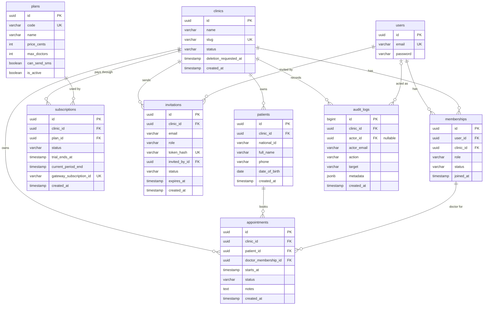

# ClinicDesk: حل التمرين الختامي للمرحلة الثانية

## البند ١: الجداول وتصنيفها

**الاختبار المستعمل:** إذا حُذفت عيادة الشفاء نهائياً، هل يجب أن يُحذف هذا الصف معها؟ نعم تعني جدول مستأجر، ولا تعني جدول منصة.

**جداول المنصة:**

- **users:** الموظفون الذين يسجّلون الدخول. هوية عامة على المنصة.
- **clinics:** العيادات، أي المستأجرون أنفسهم.
- **plans:** الخطط، وهي مشتركة لكل العيادات.

**جداول المستأجر:**

- **memberships:** عضوية الموظف في عيادة مع دوره. وهي مستأجر يعمل كجسر: المستخدم يحتاج رؤية عضوياته في كل العيادات لقائمة التبديل، والوسيط يقرأها قبل معرفة العيادة الحالية.
- **patients:** ملفات المرضى. المرضى لا يسجّلون الدخول، فالمريض ملف داخل عيادة، لا مستخدم.
- **appointments:** المواعيد.
- **subscriptions:** اشتراك العيادة. يتبع العيادة، لكن حالته لا يغيّرها إلا نظام الدفع.
- **invitations:** الدعوات. أضفتها لأن المتطلب الثاني يعني أن الموظفين ينضمون إلى العيادات، والدعوة هي طريقة الانضمام.
- **audit_logs:** سجل التدقيق. يُحذف مع العيادة، لكن العيادة لا تعدّله.

**ما لا نحتاجه، ولماذا:**

- **جدول للأطباء:** الطبيب مستخدم في users، وعضوية بدور doctor في memberships. والطبيب الذي يعمل في عيادتين له حساب واحد وعضويتان.
- **جدولا الأدوار وصلاحيات الأدوار:** المتطلب الثالث يقول إن الأدوار ثابتة. فالدور قيمة نصية في العضوية، والصلاحيات في الكود.

## البند ٢: الأعمدة

```
users (منصة)
- id: PK
- email: UK
- password

clinics (منصة)
- id: PK
- name
- slug: UK
- status: active / suspended / pending_deletion
- deletion_requested_at: فارغ إلا عند طلب الحذف
- created_at

memberships (مستأجر، يعمل كجسر)
- id: PK
- user_id: FK → users
- clinic_id: FK → clinics
- role: owner / doctor / receptionist
- status: active / suspended
- joined_at

plans (منصة)
- id: PK
- code: UK (free / pro)
- name
- price_cents
- max_doctors
- can_send_sms
- is_active

subscriptions (مستأجر)
- id: PK
- clinic_id: FK → clinics
- plan_id: FK → plans
- status: trialing / active / past_due / canceled
- trial_ends_at
- current_period_end
- gateway_subscription_id: UK
- created_at

invitations (مستأجر)
- id: PK
- clinic_id: FK → clinics
- email
- role: doctor / receptionist
- token_hash: UK
- invited_by_id: FK → users
- status: pending / accepted / revoked / expired
- expires_at
- created_at

patients (مستأجر)
- id: PK
- clinic_id: FK → clinics
- national_id
- full_name
- phone
- date_of_birth
- created_at

appointments (مستأجر)
- id: PK
- clinic_id: FK → clinics
- patient_id: FK → patients
- doctor_membership_id: FK → memberships
- starts_at
- status: booked / completed / canceled
- notes: فارغ حتى يكتبه الطبيب
- created_at

audit_logs (مستأجر)
- id: PK
- clinic_id: FK → clinics
- actor_id: FK → users، ويُسمح أن يكون فارغاً
- actor_email
- action
- target
- metadata: JSONB
- created_at
```

**أسباب القرارات المهمة:**

- **البريد فريد على مستوى المنصة:** تسجيل الدخول يحدث قبل اختيار العيادة، والطبيب له حساب واحد مهما كان عدد عياداته.
- **حالة العيادة عمود نصي، لا نعم أو لا:** عندنا ثلاث حالات، لا حالتان.
- **تاريخ طلب الحذف:** الحالة تقول "ننتظر الحذف"، والتاريخ يقول منذ متى، فتعرف المهمة اليومية متى انتهت مهلة الثلاثين يوماً.
- **الأدوار من متطلبات ClinicDesk:** owner و doctor و receptionist، لا أدوار نظام المدارس.
- **حالة العضوية active أو suspended فقط:** الدعوات المعلقة يحفظها جدول الدعوات، والعضوية لا تُنشأ إلا بعد القبول. والإيقاف المؤقت أفضل من الحذف، لأنه يحفظ التاريخ.
- **الحد هو max_doctors لا max_members:** المتطلب السادس يحدد عدد الأطباء، وموظفو الاستقبال لا يُحسبون.
- **can_send_sms عمود في الخطة:** الكود يسأل عن الميزة نفسها، لا عن اسم الخطة.
- **السعر بالسنتات:** الأرقام العشرية العادية تنتج أخطاء تقريب في المال.
- **gateway_subscription_id:** بوابة الدفع لا تعرف إلا معرّفاتها، وبه نعرف أي اشتراك تقصد رسالتها.
- **trial_ends_at و current_period_end:** إذا لم تصل رسالة من البوابة، يعتمد النظام على مقارنة التواريخ.
- **الدعوة تحفظ البريد لا المستخدم:** المدعو قد لا يملك حساباً بعد.
- **الدعوة بدور doctor أو receptionist فقط:** الملكية تُنقل بخطوة منفصلة ومقصودة، لأن الدعوة رابط قد يصل إلى الشخص الخطأ.
- **بصمة الرمز لا الرمز:** لو سُرقت قاعدة البيانات، لا تتحول البصمات إلى روابط تعمل.
- **expires_at وحالات الدعوة الأربع:** الرابط القديم يُغلق تلقائياً، والإلغاء بقرار شخص يختلف عن الانتهاء بمرور الوقت.
- **رقم الهاتف في ملف المريض:** تحتاجه رسائل التذكير النصية.
- **الطبيب في الموعد يشير إلى العضوية لا المستخدم:** العضوية تعني "أحمد يعمل في هذه العيادة". وإذا ترك أحمد العيادة نوقف عضويته ولا نحذفها، فتبقى مواعيده القديمة صحيحة.
- **لا عمود لنهاية الموعد:** الطول ثابت نصف ساعة، فالنهاية تُحسب. ونضيف العمود إذا صارت الأطوال مختلفة.
- **الملاحظات عمود في الموعد:** العلاقة واحد إلى واحد. ونفصلها في جدول إذا صار للموعد أكثر من ملاحظة، أو احتجنا تاريخ التعديلات.
- **actor_email في السجل:** إذا حُذف حساب الفاعل، يبقى السجل يقول من فعل ذلك.
- **metadata من نوع JSONB:** كل فعل له تفاصيل مختلفة.

## البند ٣: القيود

**قيم فريدة على مستوى المنصة:**

- **users.email:** بأحرف صغيرة.
- **clinics.slug.**
- **plans.code.**
- **subscriptions.gateway_subscription_id.**
- **invitations.token_hash.**

**قيم فريدة داخل العيادة:**

- **memberships:** user_id مع clinic_id. عضوية واحدة لكل شخص في كل عيادة.
- **patients:** clinic_id مع national_id. المريض نفسه قد يكون له ملف في عيادتين.

**قيود فريدة مشروطة:**

- **subscriptions:** clinic_id، بين الصفوف غير الملغاة. اشتراك فعّال واحد، مع حفظ الاشتراكات القديمة كتاريخ.
- **invitations:** clinic_id مع البريد بأحرف صغيرة، بين الدعوات المعلقة فقط.

**مفاتيح أجنبية مركّبة:**

- **appointments:** clinic_id مع patient_id، تشير إلى clinic_id مع id في patients.
- **appointments:** clinic_id مع doctor_membership_id، تشير إلى clinic_id مع id في memberships.
- **قيد فريد مساعد:** على clinic_id مع id في patients وفي memberships، لأن المفتاح المركّب يجب أن يشير إلى أعمدة فريدة.

**القاعدة العامة:** كل مفتاح أجنبي في جدول مستأجر، يشير إلى جدول مستأجر آخر، يحتاج مفتاحاً مركّباً مع عمود العيادة.

**قواعد في الكود، تحرسها الاختبارات،** لأن المفاتيح الأجنبية تتحقق من وجود الصف فقط، لا من قيمة عمود داخله:

- **عضوية الموعد يجب أن يكون دورها doctor.**
- **مالك واحد على الأقل في كل عيادة.**
- **عدد الأطباء لا يتجاوز max_doctors في خطة العيادة.**
- **بريد من يقبل الدعوة يطابق بريد الدعوة.**

## البند ٤: الفهارس

**القاعدة:** أعمدة المساواة أولاً، ثم عمود المدى أو الترتيب.

| الشاشة | الفهرس | السبب |
|---|---|---|
| مواعيد العيادة اليوم | appointments: clinic_id، ثم starts_at | نصفّي حسب العيادة، ثم نبحث في مدى اليوم |
| مواعيد طبيب في يوم | appointments: clinic_id، ثم doctor_membership_id، ثم starts_at | فهرس الشاشة الأولى سيقرأ مواعيد كل الأطباء ويرمي معظمها |
| البحث عن مريض باسمه | patients: clinic_id، ثم full_name | للاسم الكامل أو أوله. والبحث عن كلمة في وسط الاسم يحتاج نوعاً خاصاً من الفهارس |

**ملاحظتان:**

- **القيد الفريد على clinic_id مع national_id فهرس بنفسه،** فالبحث برقم الهوية سريع دون فهرس إضافي.
- **Django ينشئ فهرساً على clinic_id وحده لكل مفتاح أجنبي.** وفهارسنا المركّبة تبدأ بـ clinic_id، فيمكن إلغاء الفهارس التلقائية المكررة في الجداول الكبيرة.

## البند ٥: منع الحجز المزدوج مع التزامن

**طبيعة القاعدة:** "لا موعدان للطبيب نفسه في الوقت نفسه" قاعدة عن **صفين متطابقين**، لا عن عدد.

**الحل:** قيد فريد مشروط على clinic_id مع doctor_membership_id مع starts_at، بين المواعيد التي حالتها ليست canceled.

**ماذا يحدث عند التزامن:** يصل الحجزان في اللحظة نفسها، فتقبل قاعدة البيانات الأول، وترفض الثاني بخطأ تكرار. والكود يعرض للموظفة الثانية: "هذا الوقت حُجز للتو".

**لماذا لا نقفل صف العيادة:**

1. **القفل يعتمد على أن يتذكره كل مكان في الكود يحجز موعداً.** أما القيد فتطبقه قاعدة البيانات على كل إدخال.
2. **القفل يجعل كل حجوزات العيادة تصطف،** حتى حجوزات الأطباء الآخرين.
3. **القيد يعمل حتى مع التزامن الكامل.**

**لماذا القيد مشروط:** الموعد الملغى يبقى في الجدول، لأن المتطلب السابع يريد معرفة من ألغاه ومتى. ولولا الشرط، لمنع الصف الملغى حجز الوقت نفسه من جديد.

**القاعدة:** قاعدة عن عدد ← قفل. قاعدة عن صفين متطابقين ← قيد فريد.

## السؤال الإضافي: الطبيب في عيادتين

**هل يمنع التصميم حجز أحمد في العيادتين في الوقت نفسه؟** لا. القيد يحتوي clinic_id، والعيادتان مختلفتان، والعضويتان مختلفتان.

**هل يجب أن يمنعه؟** لا. فحص مواعيد أحمد في عيادة النور يعني أن عيادة الشفاء ترى أو تستنتج بيانات عيادة أخرى. فرسالة مثل "أحمد مشغول الساعة العاشرة" تكشف أن له موعداً في عيادة أخرى، وهذا تسريب بين المستأجرين. والطبيب أحمد هو المسؤول عن ترتيب مواعيده، وكل عيادة تحجز له في ساعات عمله عندها فقط.

**فكرة للمستقبل:** يمكن أن يرى أحمد بنفسه جدولاً يجمع مواعيده في كل عياداته، لأنه يرى بياناته هو عبر عضوياته، ولا ترى عيادة بيانات عيادة أخرى.

## المخطط الكامل


